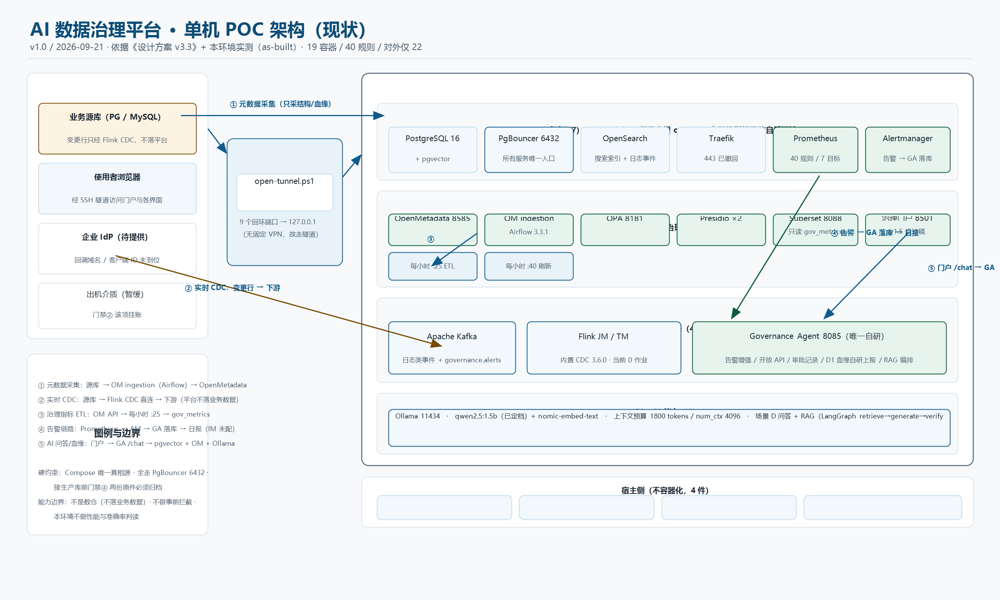

# AI 数据治理平台 · 单机 POC

> **一句话**：面向"离线治理 + 实时链路 + AI 能力"的**开源单机 POC**——把**元数据治理**（OpenMetadata）、**实时变更捕获**（Flink CDC）、**治理指标**（Superset/门户）、**告警与自研编排**（Prometheus/Alertmanager + Governance Agent）在一台服务器上跑通，并留下**可核验的证据链**。
>
> **当前状态（2026-09-21）**：**19 容器全部 healthy** · **告警规则 40 条 / 7 组** · 抓取目标 **7/7 up** · **0 活动告警** · 门户 **5 页**可用 · 对外**仅 22**（其余回环 + SSH 隧道）
>
> **⚠️ 定位边界**：本仓库是 **POC（单机、功能联调）**，**不是生产方案**；**不落业务数据**（业务行数据只经 CDC 流向客户指定下游）；**不做在线拦截**（场景 E 只做事后审计 + 主动告警）。

---

## 1. 这是什么

一个**数据治理平台的参考实现与实施记录**。仓库同时承担三种角色：

| 角色 | 说明 |
|---|---|
| **方案** | 架构与决策（ADR-A1~A8）、阶段与门禁，权威源是 `方案计划/` 下的两份文档 |
| **实施** | 从 S1 底座到 S4 AI 能力的部署步骤、脚本、验收记录与**踩坑留痕**（`执行步骤/`） |
| **交付** | 面向使用/实施/运维的三本手册 + 架构现状图 + 部署脚本包（`交付物/`） |

**能力范围**：

```
离线治理   元数据采集 → OpenMetadata（唯一真理源）；治理指标 ETL → gov_metrics → 门户/Superset（只读）
实时链路   业务源库 → Flink CDC 直连 → 下游（Kafka 只做日志类事件与 governance.alerts 分发，非 CDC 通道）
AI 能力    本地 Ollama（qwen2.5:1.5b + nomic-embed-text）→ LangGraph RAG（retrieve→generate→verify）
           引用程序化校验（不存在即标注「未核实」）；上下文预算 1800 tokens / num_ctx 4096
告警可观测 Prometheus 40 条规则 → Alertmanager → Governance Agent 落库 → 每日 08:30 告警日报
血缘       作业图级血缘，由 Governance Agent 自研上报 + 每日对账（ADR-A7，v3.3 修正）
```

---

## 2. 架构一览



> 完整说明（组件清单 / 五条数据流 / ADR 摘要 / 设计 vs 实测差异）：[`交付物/04_架构设计（现状版）.md`](交付物/04_架构设计（现状版）.md)

**五条数据流（速记）**

| # | 链路 | 关键点 |
|---|---|---|
| ① | 业务源库 → OM ingestion（Airflow）→ **OpenMetadata** | 只采结构/血缘/质量统计，**不采业务行** |
| ② | 业务源库 → **Flink CDC 直连** → 下游 | **平台不落业务数据**；作业走 `submit_flink_job.sh`（干跑门禁→登记→提交→上报） |
| ③ | OM REST API → 每小时 :25 → **`gov_metrics`** | Superset/门户**只读该 schema**，不读 OM 内表（ADR-A6） |
| ④ | Prometheus → Alertmanager → **GA `/api/v1/alerts/ingest`** → `ga.alert_event` | 每日 08:30 日报；**IM 未配 ⇒ 无主动通知** |
| ⑤ | 门户 → GA `/chat` → pgvector + OM API + Ollama | 回答附**节点轨迹/检索资产/上下文预算** |

---

## 3. 目录结构

```
方案计划/      设计方案（v3.3，架构唯一权威）、实施执行计划（v2.0-r2，阶段/门禁权威）
执行步骤/      S1~S4 部署步骤、部署计划、各阶段验收记录、门禁材料包、检查清单、供应链清单
交付物/        交付物清单 · 用户操作手册 · 实施手册 · 运维手册 · 架构设计（现状版）· 部署脚本包 · 架构图
governance-agent/     唯一自研组件（告警增强 / 开放 API / 审批记录 / D1 血缘上报 / RAG 编排）
governance-portal/    治理门户（Streamlit；含 design/ 设计稿与 tools/ 四个校验脚本）
alerting/             告警规则（40 条）+ 采集器（新鲜度 / Ollama / 容器）+ 告警日报
gov-metrics-etl/      治理指标层：schema + 每小时 ETL + 覆盖率分母盘点工具
backup-restore/       备份（PG/OS/配置/出机）与恢复演练脚本
capacity-baseline/    容量基线（自压）    watermark-report/  水位周报
restore-annual-drill/ 年度化恢复演练      opa-policies/ · presidio-recognizers/  策略与识别规则（策略即代码）
superset-image/ · flink-image/           派生镜像 Dockerfile（固定基础 digest、连接器按 sha256 校验）
tools/                仓库级提交前敏感信息自检（pre-commit 钩子）
```

---

## 4. 上手路径（按角色）

| 你是 | 先读 | 再看 |
|---|---|---|
| **业务/治理用户** | [`交付物/01_用户操作手册.md`](交付物/01_用户操作手册.md) | 门户五页怎么用、问答案例与预期、FAQ、口径边界 |
| **实施/集成** | [`交付物/02_实施手册.md`](交付物/02_实施手册.md) | 前置条件 → S1~S4 判据 → 四道门禁 → 变更与回滚 → 故障处置 |
| **运维/值班** | [`交付物/03_运维手册.md`](交付物/03_运维手册.md) | 日/周巡检命令、40 条告警处置、备份恢复、容量水位、已知缺口 |
| **评审/交接** | [`交付物/00_交付物清单.md`](交付物/00_交付物清单.md) | 交付件 ↔ 版本 ↔ 状态、**未交付待办 14 项**（含责任方） |
| **测试/验收** | [`执行步骤/AI数据治理平台_单机版_测试入口与用例.md`](执行步骤/AI数据治理平台_单机版_测试入口与用例.md) | 入口怎么开、用例与期望结果（含 OM 建采集任务实跑） |

> **入口方式**：本环境**无对外 443、无固定 VPN**，统一走 **SSH 隧道**（本机脚本把 9 个回环端口映射到 `127.0.0.1`）；详见用户手册 §1。**口令一律由部署方在服务器侧管理，不入库**。

---

## 5. 硬约束与安全红线（改任何东西前先看）

1. **Compose 是 POC 期唯一部署真相源** —— 不引入 K8s/k3s 配置；
2. **所有服务经 PgBouncer 6432 访问 PostgreSQL**，不直连 5432；
3. 全部容器 `restart: unless-stopped` + healthcheck；
4. **接生产源库前**，合规边界书面文件与续接窗口签约定**必须已归档**（缺一不动生产库）；
5. 遇 `unhealthy` **不自动降级、不自行改架构**：记录日志、停止、转人工；
6. **口令 / 密钥 / 公网 IP / 主机名一律不入库**（占位符口径）；提交由 `tools/pre_push_scan.sh` + pre-commit 钩子自动拦截；
7. **判读与签字属人工专属**：门禁、准确率、风险接受、M-Prod 触发结论**不由 AI 代判**。

---

## 6. 已知缺口与待办（不粉饰）

| # | 项 | 状态 |
|---|---|---|
| 1 | **仓库可见性**：当前为 **public**，且重写前的旧提交对象**仍可按 SHA 拉取** | 🔴 需设为 private 或删除重建后重推 |
| 2 | 门禁④ 两份书面文件原件归档 | ⏳ 未归档 ⇒ **不得接生产库** |
| 3 | 门禁② / ③ 原件签字 | ⏳ 判定已过，签字待补 |
| 4 | 漏洞风险接受单（A 类 8 / B 类 2 / C 类 superset 三选一） | ⏳ 待勾选 |
| 5 | S2 准出 4 项口径（纳入范围 / 查准查全 / 样本量 / Top50 遴选） | ⏳ 待拍板 |
| 6 | 源库信息、`T_stop` + 实测 `R_WAL`、IM/Webhook、IdP、S4-3 目标仓库+CI | ⧗ 待外部输入 |
| 7 | 出机（异地）备份 | ⏳ 暂缓 ⇒ 门禁② 该项挂账 |
| 8 | 水位周报首个可判定报告 | ⧗ ≈ 2026-10-05（需连续 14 天数据） |
| 9 | 本环境**不做性能与准确率判读**（4.1.3 最小测试环境） | ✅ 已声明 |

> 完整清单（含影响与解锁方）：[`交付物/00_交付物清单.md`](交付物/00_交付物清单.md) §4

---

## 7. 文档纪律（贡献前必读）

1. **源文档只有两份**：`方案计划/` 下的设计方案与实施执行计划；`执行步骤/` 为拆解产物，**冲突以源文档为准**。
2. **每个改动都要留证据**：执行命令 + 实际输出 + 判读；跑不了的验证要写清原因。
3. **每份文档末尾追加版本记录**（版本 / 日期 / 变更要点）。
4. **一次一个主题**；改动上层文档须说明下层是否需要同步。
5. **提交规范**：`docs(主题): …` / `fix(口径): …` / `feat(模块): …`；提交前自动跑敏感信息自检（`.githooks/pre-commit`，一次性启用 `git config core.hooksPath .githooks`）。
6. **Agent 协作边界**见 [`AGENTS.md`](AGENTS.md)（三级授权：可自主执行 / 起草+人工审核 / 人工专属）。

---

## 附：文档版本记录

| 版本 | 日期 | 变更 |
|---|---|---|
| v1.0 | 2026-09-21 | 首次产出仓库首页 README：定位与边界、当前状态速览（19 容器 / 40 规则 / 5 页门户）、架构图与五条数据流、目录结构、**按角色的上手路径**、7 条硬约束与安全红线、**已知缺口 9 项（含仓库可见性 🔴）**、文档与提交纪律，并指向交付物四件套与 AGENTS |

---

*本 README 为仓库入口说明，口径以 `方案计划/` 两份源文档与 `交付物/` 为准；不含新增架构决策。*
*门禁判读、准出签字、风险接受属人工专属，AI 不代签、不代判。*

**AI 生成提示**：本成果由 AI 生成，仅供决策参考；组件版本、端口与指标数值请按实机与各记录文档核对。
