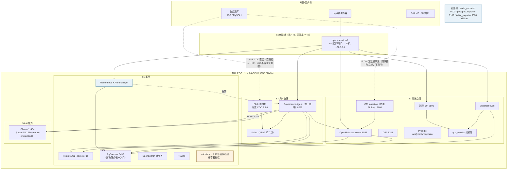

# AI 数据治理平台 · 架构设计（现状版）

> **文档版本**：v1.0（2026-09-21）
> **用途**：一页看懂"平台现在长什么样"——**设计口径**与**本环境实测（as-built）**放在一起，并标出两者的差异。
> **权威源**：`方案计划/AI数据治理平台设计方案.md`（**v3.3**，架构唯一权威）＋ `方案计划/AI数据治理平台实施执行计划_v2.0.md`（**v2.0-r2**，阶段/门禁权威）。
> **本文定位**：**派生视图**，不新增架构决策；与源文档冲突时以源文档为准。

---

## 1. 一张图（现状）

> **PNG 版**：`交付物/figures/架构图-现状-v1.0.png`（2600×1560，可直接贴 PPT/评审材料）。
> 生成脚本：`C:\Users\Yuanhui\.ai-datathink\scratch\render_arch_png.ps1`（GDI+ 自绘，配色取自 `governance-portal/design/tokens.css`；改图只需改脚本里的文案/坐标后重跑）。

### 1.1 Mermaid 版（便于在支持 Mermaid 的编辑器里查看/改）

> 上图是本环境**实际部署**；`---` 表示数据/调用关系，`.->` 表示"变更数据/元数据"的采集方向。**业务行数据不进平台自身存储**。

---

## 2. 组件清单（as-built）

| 段 | 组件 | 容器 | 版本 / 说明 | 暴露 |
|---|---|---|---|---|
| S1 | PostgreSQL（+pgvector） | `…-postgres-1` | PG16 + pgvector；承载 **6 个库**（OM 元数据 / Airflow / Superset / GA / gov_metrics） | 仅容器网 |
| S1 | **PgBouncer** | `…-pgbouncer-1` | **所有服务唯一入口 6432**（硬约束） | 回环 6432 |
| S1 | OpenSearch | `…-opensearch-1` | 单节点；OM 搜索索引 + 日志事件 | 容器网 |
| S1 | Traefik | `…-traefik-1` | **443 已停止对外发布** | 无 |
| S1 | Prometheus / Alertmanager | `…-prometheus-1` / `…-alertmanager-1` | **40 条规则 / 7 组**；AM → GA 落库 | 回环 9090 / 9093 |
| S1 | cAdvisor | `…-cadvisor-1` | ⚠️ **本环境只导出根 cgroup**（containerd 镜像存储 vs v0.45） | 容器网 |
| S2 | OpenMetadata server | `openmetadata_server` | 元数据**唯一真理源** | 回环 8585 |
| S2 | OM ingestion（Airflow） | `openmetadata_ingestion` | **Airflow 3.3.1**；采集任务在 **OM UI 建 → 下发 DAG** | 回环 8080 |
| S2 | OPA / Presidio×2 | `…-opa-1` 等 | 策略即代码 / 离线 PII 识别 | 回环 |
| S2 | Superset | `…-superset-1` | **只读 `gov_metrics`**（ADR-A6） | 回环 8088 |
| S2 | 治理门户（自研） | `…-governance-portal-1` | 按设计稿 v1.5+ 落地，5 页 | 回环 8501 |
| S3 | Kafka | `…-kafka-1` | KRaft 单节点；**只做日志类事件 + 告警分发，不是 CDC 通道** | 回环 9094（EXTERNAL） |
| S3 | Flink JM/TM | `…-flink-*-1` | **内置 CDC 3.6.0**；作业 DB 空、当前 0 作业 | 回环 8081（JM UI） |
| S3 | **Governance Agent（唯一自研）** | `…-governance-agent-1` | 告警落库增强 / 开放 API / 审批记录 / **D1 血缘自研上报** / RAG 编排 | 回环 8085 |
| S4 | Ollama | `…-ollama-1` | `qwen2.5:1.5b`（档位已定）+ `nomic-embed-text`；预算 **1800 tokens** / `num_ctx=4096` | 回环 11434 |
| — | 宿主侧 4 件 | 非容器 | node_exporter / postgres_exporter / kafka_exporter / fail2ban | docker0 网关 |

**容器数口径**：本环境实测 **19**（含把 cAdvisor 容器化）；设计方案 4.2 对外口径为 **18**（Exporters 为宿主二进制）——**对外表述用 18**，见《组件部署状态》§4。

---

## 3. 五条数据流（谁把什么送到哪）

| # | 链路 | 方向 | 关键点 |
|---|---|---|---|
| ① | **元数据采集** | 业务源库 → OM ingestion（Airflow）→ **OpenMetadata** | **只采结构/血缘/标签/质量统计，不采业务行**；UI 建任务后**必须 Deploy** |
| ② | **实时 CDC** | 业务源库 → **Flink CDC 直连** → 下游（客户指定） | **平台不落业务数据**；作业走 `submit_flink_job.sh`（干跑门禁→登记→提交→血缘上报） |
| ③ | **治理指标 ETL** | OM REST API → 每小时 :25 → **`gov_metrics`** | ADR-A6：Superset/门户**只读该 schema**，**不读 OM 内表** |
| ④ | **告警链路** | Prometheus 规则（40 条）→ **Alertmanager** → **GA `/api/v1/alerts/ingest`** → `ga.alert_event` → 每日 08:30 日报 | ⚠️ IM 未配 ⇒ **无主动通知**；GA 按规则名补处置建议 |
| ⑤ | **AI 问答 / 血缘** | 门户 → GA `/chat` → pgvector 检索 + **OM REST API** + Ollama → 回答（附节点轨迹/引用/预算） | 引用程序化校验；血缘**作业图级**（ADR-A7，GA 自研上报 + 每日 04:10 对账） |

---

## 4. 网络与暴露面

| 项 | 现状 |
|---|---|
| 网络 | Compose 三网：`frontend-net` / `backend-net`（internal）/ `data-net`（internal） |
| 对外暴露 | **仅 22**（已限源 + fail2ban）；**443 已撤回** |
| 其他服务 | 全部绑 **127.0.0.1 回环**；三个 exporter 绑 docker0 网关（172.17.0.1） |
| 使用者访问 | **SSH 隧道**（`open-tunnel.ps1`，9 个入口映射到本机 127.0.0.1）——因**无固定企业 VPN** |

---

## 5. 关键架构决策（ADR-A1~A8，摘自设计方案 §9）

| ADR | 决策 | 一句话要点 |
|---|---|---|
| **A1** | 保留直连，内置两段式开关 | CDC 默认 **Flink CDC 直连**；需要时切"CDC → Kafka `cdc.*` Topic → 处理作业"，**只加 Topic，不引入新组件** |
| **A2** | **CDC 可靠性四件套** | 续接窗口签约定 + PG 复制槽安全保护 + 作业自动拉起 + 重快照预案 |
| **A3** | 场景 E 三面分离 | 决策面（OPA）/ 执行面（查询引擎原生能力）/ 审计面（异步）；**POC 只做事后审计 + 主动告警，不做事前拦截** |
| **A4** | Checkpoint 存储按形态拆分 | 单机=本地盘 + 每日出机；3 节点=共享对象存储（SeaweedFS）+ rocksdb 增量 |
| **A5** | 质量口径拆分 | **快照基线=权威质量指标（进看板）**；**增量窗口=异常告警（仅进告警通道，不进看板）** |
| **A6** | 指标层解耦 | 治理指标落独立 **`gov_metrics`** schema，Superset/门户只读它，**不直连 OM 内表** |
| **A7** | 血缘粒度与验收 | **作业图级**（作业启动/变更时上报）；准确率 Top 50 ≥90%；CI/CD **先提示后阻断**；唯一真理源 OpenMetadata。**v3.3 修正**：上报机制改为 **GA 自研上报**（OpenLineage 路线实测不可行） |
| **A8** | 容量重算 | 每节点 = PG全量×1.3 + 日增×Kafka保留 + OS索引 + Checkpoint + 系统盘 + 20% 余量 |

---

## 6. 设计 vs 本环境实测（差异必须知道）

| # | 设计口径 | 本环境实际 | 性质 |
|---|---|---|---|
| 1 | 约 **18** 容器 | **19**（cAdvisor 也容器化） | 口径差异，**对外用 18** |
| 2 | 最小暴露 **仅 443** | **443 已撤回**，改 SSH 隧道 | 因无固定 VPN；已在部署记录声明 |
| 3 | 血缘用 **OpenLineage Flink 集成** | **GA 自研上报**（v3.3 已回写 ADR-A7） | 实测不可行后的**已批准修正** |
| 4 | cAdvisor 提供容器级指标 | **只导出根 cgroup**（containerd 镜像存储 vs v0.45；镜像源被拦） | ⛔ 外部阻塞；**已由自采探针替代** |
| 5 | 源库已接入、有真实实时链路 | **未接源**：Flink 0 作业、Kafka 无业务 topic、OM 仅 1 资产 | 待门禁④ + 源库信息 |
| 6 | 出机（异地）备份 | **暂缓** ⇒ 门禁② 该项挂账 | 人工决定 |
| 7 | 湖仓一体（Phase 5）、Iceberg/Trino | **未启用**（触发式组件默认关闭） | 符合纪律 |

---

## 7. 硬约束（任一违反即缺陷）

1. **Compose 是 POC 期唯一部署真相源**——不引入 K8s/k3s 配置；
2. **所有服务经 PgBouncer 6432 访问 PostgreSQL**，不直连 5432；
3. 全部容器 `restart: unless-stopped` + healthcheck；
4. **接生产源库前，合规边界书面文件与续接窗口签约定必须已归档**（缺一不动生产库）；
5. 遇 `unhealthy` **不自动降级、不自行改架构**：记录日志、停止、转人工。

---

## 8. 能力边界（对外要说清的三条）

- **不是数据仓库**：平台不落业务数据；PG 里的 6 个库都是"元数据 / 组件自身元数据 / 平台自持指标"（最大表几百 KB）。
- **不是在线拦截**：场景 E 只做事后审计 + 主动告警（ADR-A3），Presidio 只做**离线**识别。
- **本环境不做性能与准确率判读**：属 4.1.3 最小测试环境，只做功能联调；容量与水位数据均为**自压/工程经验**。

---

## 附：文档版本记录

| 版本 | 日期 | 变更 |
|---|---|---|
| v1.0 | 2026-09-21 | 首次产出"现状版"架构设计：**架构图（PNG `figures/架构图-现状-v1.0.png` 2600×1560 + Mermaid 版）**、as-built 组件清单（19 容器口径与 18 对外口径）、**五条数据流**（元数据采集 / 实时 CDC / 指标 ETL / 告警链路 / AI 问答与血缘）、网络与暴露面（仅 22 + 隧道）、**ADR-A1~A8 摘要**、**7 条设计 vs 实测差异**、5 条硬约束与 3 条能力边界。PNG 用 GDI+ 自绘（配色取自设计令牌），渲染后经 OCR 复验文案无截断。**未新增架构决策**，与源文档冲突以《设计方案 v3.3》《实施执行计划 v2.0-r2》为准 |

---

*本文件为现状版架构视图（派生文档），权威源为《AI数据治理平台设计方案 v3.3》；不含新增架构决策。*
*准确率判定、准出签字、M-Prod 触发结论属人工专属，Agent 不代判。*

**AI 生成提示**：本成果由 AI 生成，仅供决策参考；组件版本与端口以服务器 `docker compose ps` 与各记录文档为准。
