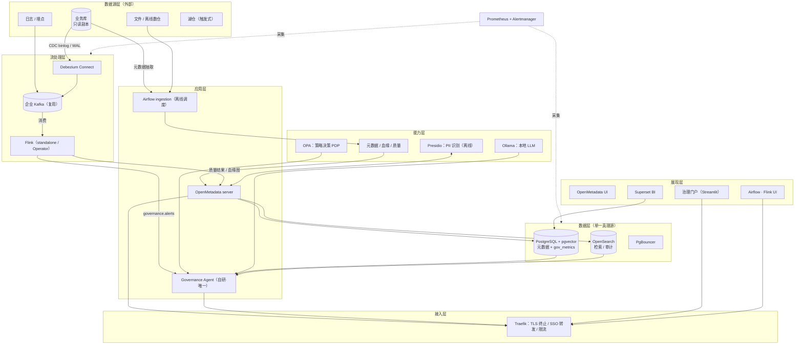
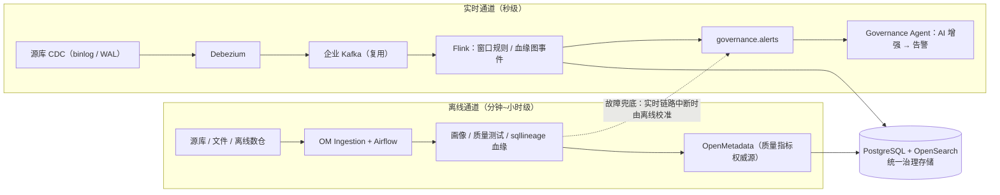
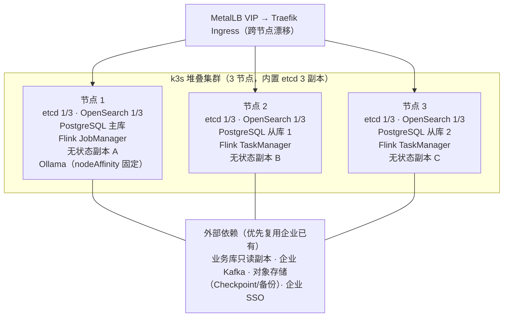
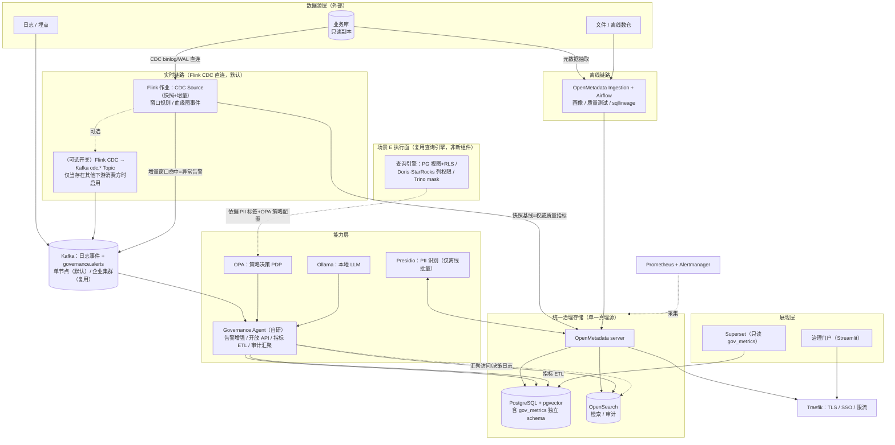

# AI 数据治理平台 · 评审与调整过程记录

> **定位**：本文档是设计方案演进过程（v2.0 评审 → v3.0 → v3.1 → v3.2）的四份过程稿合并归档，供追溯每一条设计决策的来龙去脉。**当前有效的设计文档是《AI数据治理平台设计方案.md》（v3.2）**，本文档仅作历史记录，不再维护。
> **合并日期**：2026-09-15。初版全文备份：《AI数据治理平台设计方案_v3.0_初版.md》。

## 演进时间线与最终采纳状态

| 时间 | 过程稿 | 当时结论 | 在 v3.2 中的归宿 |
|---|---|---|---|
| 09-14 | ① v3.0 评审建议稿 | 针对 v2.0（三节点高可用版）首轮评审：识别 4 处硬伤、提两阶段路线 | 硬伤修复全部进入 v3.0 正式版与 v3.2 第 9 章 ADR |
| 09-14 | ② v3.0 单机优先版评估报告 | 评估用户改版（单机优先 + Flink CDC 直连）：方向正确，但有 3 项未声明降级、6 处表述残留冲突 | 降级对策 → ADR-A1/A2；表述冲突 → v3.2 的 11 处修正 |
| 09-15 | ③ v3.1 架构调整版（v3.1.0 → v3.1.1） | 组件零新增零替换前提下的 8 条 ADR；v3.1.1 修复 A2 两处 P1 | 全文合入 v3.2 第 9 章（ADR-A1~A8）及第 10/11 章 |
| 09-15 | ④ v3.1 评审意见 | 总评 8.5/10 可合入；发现 A2 公式矛盾与 PG 复制槽盲区、修正清单补全至 11 处 | P1 修复 → v3.1.1（已合入 v3.2）；11 处清单 → v3.2 正文修正 |

> 后续如需追溯某条决策的原始论证（为什么改、当时的备选项、代价分析），按上表定位到对应部分查阅原文。

---


# 第一部分：设计方案 v3.0 评审建议稿（2026-09-14）

---

# AI 数据治理平台设计方案 v3.0（POC 单机起步 → 生产三节点演进）

> **文档定位**：v3.0 是《设计方案 v2.0》的修订版，并把《实施执行计划 v1.1》的落地约束（人力、RACI、Agent 执行边界）纳入设计前置条件。
> **与既有文档的关系**：v2.0 的组件选型与开源协议核查**全部保留、结论不变**（该部分复核无误）；v3.0 只改部署形态、修复 4 处硬伤、补齐 3 处缺失。
> **版本依据**：企业现状已确认——团队 5 人以上含平台/运维团队、处于 POC 阶段、预算紧、已有基础设施可复用、有明确的实时治理场景。

---

## 0. 变更摘要（v2.0 → v3.0）

| # | 项目 | v2.0 | v3.0 | 变更理由 |
|---|---|---|---|---|
| 1 | 部署默认形态 | 3 节点 k3s 为默认推荐 | **POC 单机（1 台）→ 生产 3 节点**两阶段 | POC 阶段买 3 台去验证可用性，与"预算紧 + POC"错配；且 v2.0 自定 RTO ≤4h，秒级切换的投资逻辑不成立 |
| 2 | Kafka | 自建 Strimzi 3 broker 集群 | **优先复用企业已有 Kafka**；自建降为触发式预案 | 已有基础设施 + 预算紧；避免在企业内形成第二条消息总线 |
| 3 | Flink Checkpoint | 落本地磁盘 | **统一走 S3 兼容对象存储**；无对象存储时明确"无跨节点恢复能力" | 硬伤 1：本地盘与 3 节点 HA 恢复互相矛盾 |
| 4 | 状态组件存储边界 | "K8s 自动重新调度" | **明确 local-path PV 带节点亲和、状态 Pod 不可漂移**；补 API Server VIP、禁用 Klipper | 硬伤 2：文档承诺了实现不了的能力 |
| 5 | 场景 E 在线脱敏 | 请求经 Governance Agent 动态脱敏（毫秒级） | **执行点下沉到查询引擎原生能力**；POC 期只做审计与告警 | 硬伤 3：业务库 JDBC 直连不经过自研服务，无执行点 |
| 6 | 容量口径 | "每节点按完整数据量规划" | **分区级副本按 1/N 计算**，附公式；Kafka 保留期与磁盘联动 | 硬伤 4：大型档 Kafka 保留 7 天需 3.5TB/节点，而单节点盘仅 4TB |
| 7 | Superset 数据源 | 直连 OpenMetadata 的 PostgreSQL 库 | **读独立 `gov_metrics` schema**（ETL 抽取） | OM 不承诺内部 schema 稳定性，升级会打挂大盘 |
| 8 | 血缘表述 | "实时血缘事件" | 修正为**作业图级血缘（job-graph）**，并给出准确率验收标准 | Flink OpenLineage 是启动/变更时上报，非事件级 |
| 9 | 质量口径 | 两套规则引擎并列写 OM | **实时=变更流异常告警；离线=质量指标**，口径唯一 | 避免"变更行空值率"被当成"全表空值率"使用 |
| 10 | 平台自身安全 | 未涉及 | 新增**平台安全基线**章节 | 主打合规的平台自身不能缺安全设计 |
| 11 | 治理运营 | 未涉及 | 新增**治理运营模型**（角色/流程/度量） | 平台是工具，治理是流程；这是同类项目最常见的真实失败原因 |
| 12 | 需求基线 | 需求 2 被单方面改为 3 节点 | **需求回签：POC 单机 + 生产三节点** | 方案不得单方面修改需求，需需求方书面确认 |

> 组件清单、许可证核查、触发式可选扩展（2.2）、不采用清单（2.3）、UI 覆盖盘点（2.4/2.5）、双链路设计（3.1~3.3）、湖仓扩展（3.5）**均沿用 v2.0**，本文不再重复。

---

## 1. 需求回签与设计约束

### 1.1 需回签的需求变更

| 原始需求 | v2.0 处理 | v3.0 处理 | 待确认 |
|---|---|---|---|
| 需求 2：可单机部署 | 改为"3 节点高可用部署" | 改为"POC 单机部署 + 生产演进至 3 节点"，两条路径都给设计与验收标准 | **需需求方书面确认**（否则验收标准会打架） |
| 需求 3：可落地场景 | 5 个场景 | 场景 A/B/C/D 进 POC；E 重设计（见 4.3）；F 触发式 | 场景 E 的能力边界需合规方确认（见 4.3.4） |

### 1.2 设计约束（已确认）

| 维度 | 现状 | 对设计的影响 |
|---|---|---|
| 团队 | 5 人以上，含平台/运维，具备 K8s 能力 | 3 节点在生产期可行；POC 期不必提前使用 K8s |
| 阶段 | POC / 试点 | 目标是验证"有人用、数据准"，不是验证可用性 |
| 预算 | 紧 | 复用已有基础设施优先；硬件两阶段投入 |
| 已有基础设施 | 待盘点（Kafka / IdP / 监控 / 对象存储 / CMDB） | **盘点结果直接决定组件清单**，见第 3 章 |
| 实时场景 | 有明确的秒级异常发现需求 | 实时链路进 POC，但只接 1 条流 |

> **前置动作（Phase 0 前 3 个工作日）**：INFRA 完成已有基础设施盘点并输出清单——Kafka（版本、是否支持多租户 ACL、跨环境可达性）、IdP（协议与对接方式）、监控栈（Prometheus/Grafana 是否已有）、对象存储（S3 兼容与否）、CMDB（可否导出资产清单）。此清单是 v3.0 组件清单的输入，未盘点前不要采购与部署。

---

## 2. 目标架构（两阶段）

### 2.1 阶段一：POC 单机（1 台 24C/96G/2TB）

```
[浏览器: 业务/分析/治理人员]
        │ HTTPS :443
        ▼
┌──────────────── 单机服务器（24C / 96GB / 2TB NVMe）────────────────┐
│ [Traefik 统一入口: TLS / SSO 转发 / 限流]                          │
│       │                                                          │
│ 展示层 [OpenMetadata UI] [Superset] [治理门户 Streamlit]          │
│ 应用层 [OpenMetadata server] [Governance Agent（自研·唯一）]       │
│ 数据层 [PostgreSQL+pgvector] [OpenSearch] [PgBouncer]            │
│ 流处理 [Debezium Connect] → [Flink standalone（JM+TM 同机）]      │
│ AI/策略 [Ollama 7B] [Presidio] [OPA]                             │
│ 运维   [Prometheus + Alertmanager + Exporters]                    │
└───────┬─────────────────┬────────────────────┬───────────────────┘
        │ CDC binlog/WAL  │ 读/写 Topic        │ 每日备份 + WAL 归档
        ▼                 ▼                    ▼
 [业务库只读副本]  [企业已有 Kafka 集群]   [NAS / 企业对象存储]
```

**单机档设计要点**（详细设计见《单机版设计方案 v0.1》，v3.0 采纳并补充）：

| 项 | 设计 | 说明 |
|---|---|---|
| 编排 | Docker Compose（以 OM 官方 quickstart 为底座） | 平台团队有 K8s 能力但 POC 无需使用 |
| Kafka | 复用企业集群，本机零 broker | 本机只跑 Debezium Connect 与 Flink 消费者 |
| Flink Checkpoint | 优先落企业对象存储；无则落本机数据盘 + 每日出机 | 单机无跨节点恢复问题，但需为迁移做准备 |
| 数据盘 | 独立 2TB，`/data/<服务>` bind mount | 迁移时整目录带走 |
| 备份 | PG 每日全量 + WAL 归档 15 分钟级 → NAS | 单机无 HA，用备份换 RPO |
| AI | Ollama 7B CPU，SLO = 流式首 token < 10 秒 | 放弃"秒级完整回答"（CPU 实测 5~15 token/s） |
| 规模上限 | 表 <1 万、并发 <20 用户、单机资源水位 <70% | 超限即为触发 3 节点演进 |

### 2.2 阶段二：生产 3 节点（承接 v2.0 第 6 章，附修正）

v2.0 的 3 节点拓扑（k3s stacked etcd + CloudNativePG + Strimzi + OpenSearch Operator + Flink Operator + MetalLB）**整体保留**，落地时必须叠加以下修正：

1. **入口**：Traefik 由 MetalLB 提供 VIP 之外，**k3s API Server（6443）也需 VIP**（kube-vip 或 keepalived），否则控制面入口仍是单点（影响 Operator 协调与扩容，不影响已运行负载）；
2. **ServiceLB**：引入 MetalLB 前**显式禁用 k3s 内置 Klipper**，避免抢 LoadBalancer Service；
3. **存储**：继续用 local-path-provisioner（不引入 Ceph/Longhorn），但必须承认其边界（见 4.2）；
4. **Checkpoint**：`state.checkpoints.dir` / `savepoints.dir` 指向共享对象存储，**否则 Flink HA 恢复不成立**；
5. **键值安全**：k3s 启用 secrets 加密（`--secrets-encryption`），密钥托管到企业 KMS/Vault；
6. **Kafka**：优先接入企业集群（治理平台只建 Topic）；仅当企业集群不满足隔离/多租户要求时，才用 Strimzi 自建 3 副本集群。

### 2.3 演进触发条件（满足任一即启动阶段二）

| 触发条件 | 判定方式 |
|---|---|
| POC 通过且需向多业务线承诺 SLA | PM + ARCH 评审确认 |
| 单机资源水位持续 >70% | Prometheus 连续 14 天数据 |
| 接入源 >5 个 / 并发用户 >20 / 表数 >1 万 | 平台侧统计 |
| 合规审计要求冗余部署 | SEC + LEGAL 提出 |
| 实时事件吞吐 >100 events/s 且要求不中断 | 监控数据 |

**启动前必须完成**：第 4 章 4.1~4.6 全部修复项验收 + 第 5.2 节磁盘重算落地 + 一次真实恢复演练。

---

## 3. 复用已有基础设施（成本优化设计）

| 能力 | v2.0 默认（自建） | v3.0 设计 | 复用后省下的东西 |
|---|---|---|---|
| 消息流 | Strimzi 管理 3 broker Kafka | **接入企业已有 Kafka**：只申请 Topic + ACL + 保留策略 | 3 副本磁盘、Strimzi Operator、broker 运维；迁移时唯一不用搬的组件 |
| 统一认证 | Keycloak（触发式） | **对接企业 AD/LDAP/SSO** | 一套 IdP 的运维与账号体系，Keycloak 永不部署 |
| 监控 | kube-prometheus-stack 全套自建 | 有则**注册进现有监控**，仅新增治理专属指标与告警 | Prometheus/Grafana/Alertmanager 的运维与存储 |
| 对象存储 | SeaweedFS（触发式） | 复用已有 MinIO/Ceph/OSS，用于 Flink Checkpoint + 备份 | 一套存储层的部署与容量规划 |
| 资产冷启动 | 全靠 ingestion 抽取 | 从 **CMDB 导入**初始资产清单，ingestion 只做增量与校验 | 首轮盘点的时间（场景 A 冷启动加速） |
| 查询引擎 | Trino 单节点（湖仓触发） | 若已有 Doris/StarRocks 且挂载湖仓 Catalog，直接复用 | 一个查询引擎的部署与调优 |

> **设计纪律**：复用项必须在设计文档中标注"**外部依赖**"，并在《执行计划》第 2.3 节登记责任人与到位时点；外部依赖不可用时的预案必须写清（例：企业 Kafka 跨环境不可达 → 启用本机单 broker KRaft 预案，v2.0 6.3.1 已有配置示例）。

---

## 4. 硬伤修复设计（上生产前必须验收）

### 4.1 修复 1：Flink Checkpoint 与状态恢复

| 形态 | 设计 | 边界说明（必须写进运维手册） |
|---|---|---|
| POC 单机 | 优先 `s3://<bucket>/flink/checkpoints`；无对象存储则落 `/data/flink/checkpoints` + 每日 rsync 出机 | 单机场景不存在跨节点恢复问题 |
| 生产 3 节点 | **必须**共享对象存储；`state.backend: rocksdb`；`num-retained: 3`；Savepoint 在版本升级前必做 | 若坚持本地盘：JobManager/TaskManager 一旦漂移到其他节点，checkpoint 不可读，**恢复能力等于零**，此时不应宣称 Flink HA |

### 4.2 修复 2：状态组件存储边界与调度

**事实**：local-path-provisioner 生成的 PV 带 `nodeAffinity`（绑定主机名），PVC 绑定后不可漂移。

| 组件 | 节点故障后的真实行为 | 需写入文档的能力边界 |
|---|---|---|
| CloudNativePG | 存活从库被提升为主库（副本机制生效） | 失联节点的实例只能等节点恢复后归队 |
| OpenSearch | 副本分片在其他节点可用，索引降为 yellow | 分片重新分配受剩余节点容量约束 |
| Kafka | 分区 leader 切到其他副本 | 同上 |
| 全部 StatefulSet Pod | **无法重新调度**（PVC 绑死节点），持续 Pending | 4.4 节中"自动重新调度"仅适用于无状态服务 |

**补充设计**：kube-vip 提供 API Server VIP；禁用 Klipper；启用 secrets 加密；PodDisruptionBudget 防止维护时批量驱逐。

### 4.3 修复 3：场景 E 重设计（访问控制与脱敏）

**问题**：现设计把 Governance Agent 当作数据访问路径上的执行点，但业务系统走 JDBC 直连数据库，不会经过它；Presidio 是批量文本处理库，不适合在线逐行脱敏。

**重设计（决策面 / 执行面 / 审计面分离）**：

| 面 | 组件 | 职责 |
|---|---|---|
| 决策面（PDP） | OPA + OM 的 PII 标签 | 输出"谁在什么条件下能访问哪些列"的策略结论，Rego 代码 Git 管理 |
| 执行面（PEP） | **数据所在引擎的原生能力**：PG 视图 + RLS、Trino 列级 mask/视图、StarRocks/Doris 列级权限 | 在 SQL 引擎内完成脱敏与拒绝；**不引入自研 SQL 代理** |
| 审计面 | Governance Agent + OpenSearch | 记录访问决策与审计留痕（异步、不阻塞查询） |
| 识别面 | Presidio（离线批量） | 仅做批量 PII 识别与脱敏输出，不进在线路径 |

**POC 期能力边界（须与合规方确认）**：只做**事后审计 + 主动告警**（"谁访问了敏感列"），**不做事前拦截**。若合规要求事前拦截，唯一现实路径是推动业务通过受管查询引擎访问数据（属组织变革，不是组件选型问题）。

**审批最小状态机**（若保留人工审批）：`申请 → 策略预评估（OPA）→ 审批人决策（IM 卡片/门户）→ 授权（带时效）→ 到期自动回收 → 审计落库`。状态与审批记录落 PostgreSQL 独立表，不做只读通知式的"假审批"。

### 4.4 修复 4：容量重算（修正磁盘口径）

**正确口径**：
- **PostgreSQL**：每个实例都是全量拷贝 → 每节点磁盘 = 全量数据 ×1.3 余量
- **Kafka / OpenSearch**：副本是**分区级**的 → 每节点 ≈ 唯一数据量 × RF ÷ 节点数；RF=3、3 节点时，**每节点 ≈ 唯一数据量**（即 日增 × 保留天数）
- 元数据治理负载由**表数量**决定；Kafka 磁盘由**事件吞吐**决定——两者不能混算（v3.0 拆分两张表）

**Kafka 磁盘速查（每节点）**：

| 日增变更量 | 保留 1 天 | 保留 3 天 | 保留 7 天 |
|---|---|---|---|
| 10GB | 10GB | 30GB | 70GB |
| 100GB | 100GB | 300GB | 700GB |
| 500GB | 500GB | 1.5TB | **3.5TB** |

> 结论：大型档（500GB/天）若坚持保留 7 天，仅 Kafka 就需 3.5TB/节点，加上 PG 全量副本与系统盘，单节点盘需 **≥8TB**。预算敏感场景应把保留期降到 1~3 天（配合故障时从离线批处理兜底校准），而不是把磁盘买大一倍。

### 4.5 修复 5：质量口径统一

| 通道 | 定位 | 规则归属 | 输出 |
|---|---|---|---|
| 离线 | **质量指标的权威来源**（全量画像 + DQ Tests） | OpenMetadata 测试定义 | 质量看板、审计报告 |
| 实时 | **变更流异常检测与告警**（非质量指标） | Flink 作业 + 映射到 OM 的 test definition | 告警事件、异常摘要 |

**必须写进文档的一句话**：基于 CDC 变更流计算出的"窗口内空值率"是**变更行**的空值率，不等于**全表**空值率，不能作为数据质量指标对外发布。

### 4.6 修复 6：血缘准确性验收

- 明确 Flink OpenLineage 产出的是**作业图级血缘**（作业启动/变更时上报），不是逐事件血缘；变更影响分析依赖它的拓扑变化，而非数据流转明细；
- **验收标准**：核心表（试点范围内 Top 50 张）列级血缘人工抽检准确率 ≥90%；sqllineage 解析失败的 SQL 必须进入"待人工确认"队列而非静默丢弃；
- **升级节奏**：场景 C 接入 CI/CD 时先做"**提示**"（PR 评论列出影响面），准确率连续 4 周达标后再升级为"**阻断**"。

---

## 5. 容量与资源规划（重算版）

### 5.1 POC 单机档（1 台，24C/96G/2TB）

容器资源预算（内存 limits 之和 ≤ 物理内存 70%，CPU 可超配）：

| 容器 | CPU | 内存 | 容器 | CPU | 内存 |
|---|---|---|---|---|---|
| PostgreSQL+pgvector | 3 | 8GB | Flink（JM+TM） | 3 | 8GB |
| OpenSearch | 2 | 8GB | Debezium Connect | 1 | 2GB |
| OpenMetadata server | 2 | 4GB | Ollama 7B | 5 | 16GB |
| OM ingestion（Airflow） | 2 | 4GB | Presidio | 1 | 2GB |
| Governance Agent | 1.5 | 3GB | OPA / Traefik | 1 | 1GB |
| 治理门户 + Superset | 1.5 | 2.5GB | Prometheus 栈 + PgBouncer | 1.75 | 3.25GB |
| **合计** | **~25（可超配）** | **~62GB**（余 34GB 给 OS/缓存） | | | |

### 5.2 生产三节点档（修正后）

| 档位 | 表数量 | 事件吞吐 | 并发 | 每节点规格（×3） | 磁盘构成说明 |
|---|---|---|---|---|---|
| 小型 | <1,000 | <100 ev/s | <20 | 16C / 64GB / 1TB | PG 全量 + Kafka 保留 3 天 + 系统 |
| 中型 | 1,000~10,000 | 100~2,000 ev/s | 20~100 | 24C / 96GB / 2TB | 同上，按 100GB/天 ×3 天 ≈ 300GB/节点 Kafka |
| 大型 | 10,000~20,000 | 2,000~5,000 ev/s | 100~200 | 32C / 128GB / **8TB** | 500GB/天：保留 7 天需 3.5TB/节点 Kafka + PG 全量 + 余量；**若保留期降为 1~3 天，4TB 盘即可** |

**每节点磁盘估算公式**（写进采购依据）：

```
每节点磁盘 = PG全量 × 1.3  +  日增 × 保留天数(Kafka)  +  元数据索引(OpenSearch, 通常<100GB)
             + Checkpoint 保留量  +  系统盘(480GB)  +  20% 余量
```

> 超过大型档（表 >2 万 / 吞吐 >5,000 ev/s / 并发 >200）时扩容为 5 节点+，而不是继续加大单机规格。

---

## 6. 可靠性与灾备（按形态分别承诺）

| 形态 | 节点/主机故障 | RPO | RTO | 依赖 |
|---|---|---|---|---|
| POC 单机 | 全停（治理为旁路，不影响业务系统） | ≤15 分钟（PG WAL 归档） | ≤4 小时（备份重建） | 每日出机备份 + 月度恢复演练 |
| 生产 3 节点 | 容忍任意 1 节点，自动切换：PG/Kafka/OpenSearch 分钟级，Flink 数十秒（切换期实时处理短暂中断） | ≤5 分钟 | ≤1 小时（单节点故障）；区域性故障 ≤4 小时（备份重建） | 共享对象存储（Checkpoint/备份）+ 每日演练记录 |
| 2 节点同时故障 | 丧失 quorum，写入不可用（3 节点固有上限） | — | 按 5 节点扩容预案处理 | 预案必须预先演练 |

**备份矩阵**（两形态通用）：

| 对象 | 方式 | 频率 | 存放 |
|---|---|---|---|
| PostgreSQL | 基础备份 + WAL 归档（单机）/ CNPG PITR（三节点） | 每日 + 实时 | NAS / 对象存储（出机） |
| OpenSearch | snapshot | 每日 | 对象存储 |
| Flink | Checkpoint + Savepoint | 定期 + 升级前 | 对象存储 |
| 配置/IaC | Git 远端（含 Kafka Topic、OPA Rego、连接器配置、Helm values/compose） | 实时 | 代码仓库 |

---

## 7. 平台自身安全基线（新增）

| 项 | 要求 | 负责角色 |
|---|---|---|
| 密钥管理 | 数据库/对象存储/IdP 凭证入统一密钥管理（企业 KMS/Vault 或 K8s Secret + 加密）；k3s 启用 secrets 加密 | INFRA + SEC |
| 网络隔离 | 单机：Compose 分 edge/app/db 三网，`db` 网络 internal；三节点：NetworkPolicy 东西向最小开放 | INFRA |
| 边界收敛 | 仅暴露 443；PG/Kafka/OpenSearch 端口不对业务网开放；SSH 限来源 | INFRA |
| 认证 | 统一走企业 SSO（OIDC）；无原生认证的 UI（Flink/Prometheus/Traefik）经 oauth2-proxy 保护 | SEC |
| 供应链 | 镜像固定 tag/digest、来源可信、上线前扫描；禁止 `latest` 进生产 | INFRA |
| 权限 | K8s RBAC 最小权限；Agent 使用专用账号，禁止长期管理员凭证 | INFRA |
| PII 样本 | 扫描样本只保留脱敏后特征 + 置信度；原文样本留存 ≤30 天并加密；样本目录访问审计 | SEC |
| 审计 | 平台自身登录、配置变更、API 调用落 `gov_audit` 表并出机备份 | SEC |
| 补丁 | 月度窗口更新 OS 与关键镜像，更新前备份校验 | INFRA |

---

## 8. 治理运营模型（新增）

平台上线只是开始，以下流程不建立，半年内必然荒废。

| 角色（对应执行计划 RACI） | 职责 |
|---|---|
| 数据 Owner（GOV） | 认领资产、确认 PII 标签与口径、处理中置信复核任务 |
| 治理秘书（GOV 兼任） | 排期复核任务、跟踪 SLA、组织月度口径会 |
| 平台值班（DE/INFRA） | 告警响应、作业恢复、按 runbook 处置 |
| 合规接口人（SEC） | 审计问询应答、策略变更审批 |

| 机制 | 频率 | 度量指标 |
|---|---|---|
| PII 标签口径会 | 月度 | 中置信复核任务积压量、复核及时率（目标：3 个工作日内） |
| 治理成效看板（Superset） | 实时 | 资产覆盖率、敏感字段识别准确率、告警有效率、血缘准确率 |
| 误报反馈闭环 | 持续 | 每次告警可标记"误报/属实"，用于阈值调优 |
| 恢复演练 | 每月（POC）/每季（生产） | 实际恢复耗时 vs RTO |

**上线后 90 天必须回答的三个问题**：① 有多少人在用（周活）；② 识别结果准确率是否稳定在验收线以上；③ 告警是否被真正处置（而不是被静音）。

---

## 9. 与《实施执行计划 v1.1》的对接

| 执行计划 Phase | v3.0 阶段归属 | 需要的调整 |
|---|---|---|
| Phase 0 基础设施与安全底座 | 拆为 **P0-A（POC 单机底座）** 与 **P0-B（生产集群）** | P0-A：1 台服务器 + Compose + 备份 + 监控，2 周内完成；P0-B 推迟到演进触发后，原 3 节点任务整体平移，并追加 4.1~4.6 修复项验收 |
| Phase 1 离线治理闭环 | 不变，跑在单机 | 追加"Presidio 中文识别器准确率验收"（已在计划中）+ 血缘准确率抽检（4.6） |
| Phase 2 实时链路引入 | 不变 | Kafka 目标改为**企业已有集群**（若不可达则启用本机单 broker 预案）；追加"变更流指标口径说明"入文档 |
| Phase 3 AI 能力增强 | 不变 | SLO 改为"流式首 token < 10 秒"，GPU 作为唯一预留升级位 |
| Phase 4 性能加固与生产化 | 追加 **M-Prod：迁移 3 节点** 里程碑 | 迁移前置：4.1~4.6 修复验收 + 磁盘重算落地 + 恢复演练 |
| Phase 5 湖仓一体（触发式） | 不变 | Trino 优先复用已有 Doris/StarRocks |

**执行计划中资源章节需同步修改**：
- 2.2 硬件：由"服务器 ×3，Phase 0 启动前到位"改为"**POC 1 台先到位**；3 台于 M-Prod 前到位"；
- 2.2 增加一行"对象存储（POC 即需，用于 Checkpoint 与备份出机）"；
- 2.3 外部依赖增加"企业 Kafka Topic/ACL 申请"与"已有基础设施盘点（Phase 0 前 3 个工作日）"；
- 7.2 Agent 边界追加两条：**不得将数据库/对象存储凭证输出到日志**（已隐含在 P0-2 任务卡，建议上提为通则）；**生产集群的 drain/删除类操作必须有第二人确认**。

---

## 10. ADR 记录（关键决策）

| ADR | 决策 | 理由 | 代价/边界 |
|---|---|---|---|
| ADR-01 | 部署形态：POC 单机 → 生产三节点两阶段 | 阶段与预算匹配；可用性投资延后到有 SLA 需求时 | POC 期无 HA；靠备份换 RPO；需 3 条迁移纪律（Git 化、服务名调用、bind mount） |
| ADR-02 | Kafka 复用优先 | 避免第二条消息总线；省 3 副本磁盘与运维 | 依赖企业集群的隔离与保留策略；不可达时启用本机预案 |
| ADR-03 | Checkpoint 统一对象存储 | 跨节点恢复的唯一可行方案 | 引入对象存储依赖（优先复用已有） |
| ADR-04 | 状态组件用 local-path，不引入分布式存储 | 少一个组件；副本机制已能容忍 1 节点故障 | 明确"Pod 不可漂移"边界；2 节点故障丧失写入 |
| ADR-05 | 场景 E 执行点下沉到查询引擎 | 自研 SQL 代理成本远大于收益 | POC 期无事前拦截能力，需合规方确认 |
| ADR-06 | 质量口径：实时告警 / 离线指标 | 避免 CDC 语义被误用为质量指标 | 实时看板不展示"质量分" |
| ADR-07 | 指标层独立 schema | 摆脱 OM 内部 schema 不稳定风险 | 增加 Governance Agent 的 ETL 工作量（约 3~5 人天） |
| ADR-08 | 血缘先提示后阻断 | 错误血缘比没有血缘更危险 | CI/CD 阻断能力延后 4 周 |

---

## 11. 风险与待验证事项

**新增风险**：

| 风险 | 影响 | 缓解 |
|---|---|---|
| 复用依赖的可用性（Kafka/IdP/对象存储） | 外部变更直接打断平台 | 依赖登记 + 预案 + 定期连通性拨测 |
| POC 单机与生产形态差异 | 迁移成本被低估 | ADR-01 三条迁移纪律；POC 期就用 IaC 与 bind mount |
| Agent 自动化执行越界 | 生产不可逆变更 | 执行计划 7.2 边界 + dry-run 前置 + 第二人确认 |
| 治理运营缺位 | 平台建成无人用 | 第 8 章机制 + 90 天三问 |
| 实时链路与离线任务抢 CPU（单机） | 全平台卡顿 | 画像/血缘任务固定夜间窗口；Ollama 硬限 16GB + 并发限流 2 |

**待验证清单（不确定项，须在对应阶段实测/核实）**：

1. 各组件与 Operator 的具体版本号与兼容矩阵（**按官方文档核实，本文不写死版本**）；
2. PgBouncer transaction 模式与 OpenMetadata 的兼容性（Phase 0 内验证，不通过则直连）；
3. Ollama 7B 在目标 CPU 上的实际吞吐（Phase 3 实测，用于校准"首 token <10 秒"）；
4. Debezium Oracle 连接器授权边界：**LogMiner 无需商业授权，XStream 需要**（v2.0 表述需更正）；
5. 企业 Kafka 的多租户 ACL 能力与 Topic 保留策略上限；
6. OpenMetadata 版本升级的 schema 迁移影响（锁定版本 + 升级演练）。

**沿用 v2.0 第 8 章的其余风险**（CDC 源库负载、Presidio 中文覆盖不足、Ollama 能力上限、湖仓采集依赖查询引擎、对象存储凭证攻击面、小文件 Compaction、Superset 与 OM 资源争用）——其中 Superset 资源争用因 ADR-07 已缓解。

---

## 附：v3.0 交付物与验收对照

| 交付物 | 对应验收 |
|---|---|
| POC 单机环境（1 台，Compose 全栈 + 监控 + 备份） | 全容器 healthy；备份恢复演练通过 |
| 离线治理闭环（场景 A/C 离线部分） | 试点源覆盖率 100%；PII 准确率 ≥90%；血缘抽检 ≥90% |
| 实时单流（场景 B） | 端到端 P95 <30 秒；连续 1 周无未恢复故障；DBA 签字源库负载可接受 |
| AI 问答（场景 D） | 引用可核验率 100%；首 token <10 秒；≥10 名业务用户试用 |
| 生产三节点（M-Prod） | 4.1~4.6 修复项验收通过；单节点故障演练通过；PITR 演练通过 |

---

## 附录 A：架构图（Mermaid 源码，可直接粘贴）

### A1 逻辑分层架构（两阶段通用）



### A2 双通道数据流（离线 + 实时 → 同一真理源）



### A3 生产三节点部署拓扑



> **A3 图注（必须与图一同阅读）**：
> 1. 状态组件（PG / OpenSearch / Kafka 若自建）的卷来自各节点本地盘（local-path），**PV 绑定节点，节点失联时 Pod 不可漂移**，可用性由副本提升保证，失联节点的数据需等节点恢复后归队；
> 2. MetalLB 只解决 Ingress 入口单点；**k3s API Server（6443）需另配 VIP**（kube-vip/keepalived）；
> 3. Flink 的 Checkpoint / Savepoint 必须落在共享对象存储，否则 JobManager 换节点后无法恢复；
> 4. 引入 MetalLB 前先禁用 k3s 内置 ServiceLB（Klipper）；
> 5. 2 个节点同时故障会丧失 quorum，写入不可用——3 节点拓扑的固有上限，扩容预案为 5 节点。


# 第二部分：v3.0 单机优先版评估报告（2026-09-14）

---

# 《AI 数据治理平台设计方案 v3.0（开源单机优先版）》评估报告

> 评估对象：`D:\workspace\ai_datathink\AI数据治理平台设计方案.md`（v3.0）
> 相对上一轮评估的两处实质变化：① 默认部署由「3 节点优先」改为「单机优先，按需升级」；② 实时链路由「Debezium + Kafka Connect」改为「Flink CDC 直连捕获」
> 评估口径：只评变化与技术合理性，不重复组件选型与许可证核查（该部分此前的复核结论仍然成立）

---

## 0. 结论速览

| 维度 | v2.0 | v3.0（本版） | 变化说明 |
|---|---|---|---|
| 部署形态与阶段匹配 | ★★ | ★★★★★ | 单机优先，与 POC 阶段、预算约束匹配，**方向正确** |
| 组件简洁度 | ★★★ | ★★★★ | 移除 Kafka Connect + Debezium，少一个独立组件与运行面 |
| 实时链路可靠性 | ★★★ | ★★☆ | **CDC 直连带来 3 项未声明的能力降级**（缓冲/重放、故障域、多消费方），见第 2 章 |
| 架构内部自洽性 | ★★ | ★★☆ | 需求回签已补齐（加分），但出现 6 处新旧表述残留冲突，见第 4 章 |
| 容量与资源规划 | ★★ | ★★ | **磁盘口径仍未重算**，采购前必改 |
| 场景可落地性 | ★★★ | ★★★ | 场景 E **一字未改**，仍是不可落地状态 |
| 工程与运营完备性 | ★★ | ★★ | 平台安全基线、治理运营模型仍缺 |

**一句话结论**：**方向调对了，但风险和硬伤一件没修**。单机优先是这一版最大的价值；Flink CDC 的取舍也站得住，只是方案把它的代价写少了。上 3 节点或进入生产前，P0 清单（第 5 章）必须清掉。

---

## 1. 变化一：默认单机优先 —— 判断正确

与阶段（POC）、预算（紧）、运维门槛（虽有平台团队但不必提前自建 K8s）三者都对得上，6.1 的取舍说明也写清楚了。这一改动同时解决了上一轮指出的**需求偏移问题**（需求 2 原文即"可单机部署"），第 0 章已标注回签，这一点做得好。

**三点补充建议**：

1. **4.1.2 小型档与需求 5 的张力**：小型档标注"仅离线闭环，暂不含 Kafka/Flink/Superset"，但需求 5 明确要求支持实时。建议显式写明"小型档 = 离线验证档，实时链路从 4.1.2 中型档（24C/96G）起"，避免验收时被质疑未满足需求 5。
2. **单机档的 Kafka 定位要澄清**：本版仍在本机跑单节点 KRaft Kafka。若企业已有 Kafka，这是一个可再讨论的取舍——自建 = POC 自主可控、不受跨团队排期影响（**你们的场景下这个理由成立**）；复用 = 少一个组件与一份运维。**建议在文档中写明"为什么 POC 期选择自建"**，否则会被审计问"已有基础设施为何不复用"。
3. **单机档的 RTO/RPO 未按形态拆分**：4.6 仍给统一承诺（RPO ≤1h / RTO ≤4h）。单机形态下 RPO 由 WAL 归档频率决定、RTO 由备份重建决定；3 节点形态才有自动切换。建议拆成两行，承诺要与形态对应。

---

## 2. 变化二：Flink CDC 直连取代 Debezium + Kafka Connect

### 2.1 这个改动是合理的，理由成立

| 收益 | 说明 |
|---|---|
| 少一个独立组件 | 不再需要 Kafka Connect 集群/debezium connector 配置与 offset 管理，单机档省约 2 vCPU / 2GB 与一个故障点 |
| 位点与状态统一 | CDC 位点与 Flink Checkpoint 绑定持久化，只有一个恢复机制，不再维护两套 offset（这是原方案的真实痛点） |
| 快照 + 增量一体 | Flink CDC 支持"初始全量快照 → 无缝转增量"，**顺带缓解了此前指出的"变更行空值率 ≠ 全表空值率"问题**——快照阶段可拿到全量基线 |
| 湖仓路径更顺 | 3.5 的"实时入湖"用 Flink CDC → Iceberg/Delta Sink 是标准用法，比"Debezium→Kafka→Flink→Sink"链路短 |
| 许可证无冲突 | Flink CDC 现为 Apache Flink 官方子项目（apache/flink-cdc），Apache-2.0，与全案开源要求一致 |

### 2.2 但方案漏写了 3 项能力降级（必须补进文档）

| # | 降级项 | 原架构（Debezium→Kafka） | 新架构（Flink CDC 直连） | 影响与应对 |
|---|---|---|---|---|
| 1 | **缓冲与重放能力消失** | 源库变更先落 Kafka，Flink 挂了照样消费、可回放、可多下游订阅 | 源库 binlog/WAL 成为**唯一**缓冲；Flink 停机超过 binlog 保留期即**无法续接，只能重新全量快照** | 大表重新快照可能数小时并对源库产生显著负载。必须：① 与 DBA 约定 binlog 保留期 ≥ 故障恢复预算；② 写"重新快照"应急流程；③ 监控 Flink 作业可用性优先级提到最高 |
| 2 | **故障域合并** | Connect 挂 → 数据仍在 Kafka，Flink 可继续 | Flink 作业 = 捕获者 + 处理者，**作业挂 = CDC 断** | 作业需配置重启策略与自动拉起（单机档用 systemd/restart 策略；3 节点档用 Operator 的 restart nonce/升级策略），并纳入告警 |
| 3 | **多下游订阅能力下降** | 其他系统（数仓、实时大屏）可从 Kafka 复用同一份 CDC | 只有治理平台能看到这份 CDC；其他方要用只能各自再捕获一次 | **需先确认企业是否已有其他 CDC 消费方**；若有，重复捕获会叠加源库负载，建议改为"Flink CDC → Kafka → 下游"两段式（见 2.4） |

### 2.3 由此产生的文档内部矛盾（照改即可）

| 位置 | 现状表述 | 问题 | 建议改法 |
|---|---|---|---|
| 3.3.5 | "Kafka 配置合理 topic 保留时长（建议 ≥7 天）用于**日志事件**重新回放" | CDC 已不走 Kafka，回放能力对 CDC 不再存在；同一段没提 binlog 保留期这个新约束 | 分两列写：日志类事件的 Kafka 保留期；**CDC 的续接能力取决于 binlog/WAL 保留期** |
| 第 1 章 mermaid | `KAFKA[("Apache Kafka\nKRaft 3节点集群")]` | 默认已是单机，且 6.3.1 是单节点 KRaft | 改为"单节点 KRaft（默认）/ 企业 Kafka（复用）/ 3 节点（规模化后）" |
| 2.1 表 Kafka 行 | "3节点集群…通过 Strimzi Operator 管理，副本因子 3" | 同上，与默认单机不符 | 加"规模化后"限定 |
| 3.1 表实时行 | "Kafka 保留窗口内事件可重放" | CDC 场景已不成立 | 限定为日志类事件 |
| 4.2 表 Flink 行 | "Checkpoint 建议落本地盘" | 与 4.4/6.2"从最近 Checkpoint 恢复"的 HA 承诺冲突 | 单机：本地盘 + 每日出机；**3 节点：必须共享对象存储**（否则 HA 不成立） |
| 5 章场景 B | 涉及组件已更新为"Flink（内置 CDC）" | ✅ 改得对 | — |

### 2.4 落地前必须核实的 6 件事（本版未涉及）

1. **Flink CDC 与 Flink 版本的兼容矩阵**：Flink CDC 与 Flink 版本强绑定，需按官方文档锁定组合（**具体版本号请核实，本文不写死**）；
2. **Oracle 数据源的授权边界**：Flink CDC 的 Oracle 连接器底层机制与 Debezium 同源，需核实使用 LogMiner（无需商业授权）还是 XStream（需授权），v2.0 沿用至今的"需商业插件"表述应更正为准确版本；
3. **无主键表的处理**：Flink CDC 的并行增量快照依赖主键，**无主键表通常退化为单并行度或无法增量**——试点表清单里若有此类表，需提前识别（建议实测确认）；
4. **DDL 变更与 Schema Evolution**：源库 DDL 是否能被下游作业平滑处理，需要专项测试；
5. **镜像供应链**：6.3.1 用官方 `flink:1.19-scala_2.12` 镜像 + 手工把 CDC JAR 放进 `/opt/flink/lib` 的做法，建议改为**自建镜像并固定 digest**，避免"手工塞包"在重启/迁移时失效；
6. **State 增长**：多表 CDC + 窗口聚合的 state 会随表数与吞吐增长，需启用 RocksDB + 增量 Checkpoint 并监控 Checkpoint 耗时。

### 2.5 三条可选路线（供决策）

| 路线 | 做法 | 适用 |
|---|---|---|
| A. 保持直连（当前设计） | Flink CDC → Flink 作业 → OM/alerts | 仅治理平台消费 CDC、无其他下游、binlog 保留期充足 |
| B. 两段式（折中，推荐评估） | Flink CDC 捕获 → 写 Kafka → Flink 再从 Kafka 处理 | 存在其他 CDC 消费方，或需要削峰与重放保障；只多一个 Topic，不引入 Kafka Connect |
| C. 直连 + 分级 | 关键表直连、非关键表批处理覆盖 | 源库负载敏感、表数量多时 |

---

## 3. 未修复项：上一轮指出的硬伤，本版状态

| # | 问题 | v2.0 | v3.0 本版 | 何时必须修 |
|---|---|---|---|---|
| 1 | **场景 E 无执行点**（业务库 JDBC 直连不经过治理平台；Presidio 不适合在线逐行脱敏；"毫秒级决策"无依据） | 未修 | **完全未改，逐字保留** | **P0，POC 范围确认前**——至少要写明"POC 期不做事前拦截，只做事后审计"，否则是能力虚标 |
| 2 | **Flink Checkpoint 落本地盘 ⇄ 3 节点 HA 恢复** | 未修 | 未修（4.2 仍写"建议落本地盘"，与 6.2 HA 承诺并存） | **P0，3 节点启动前**（单机档可接受） |
| 3 | **local-path PV 节点亲和 → 状态 Pod 不可漂移** | 未说明 | 未说明（4.4 承诺 Flink/OpenSearch "恢复"易被读成 Pod 漂移） | P1，3 节点启动前补能力边界说明；同时补 API Server VIP、禁用 Klipper |
| 4 | **磁盘容量算不平**（大型档 500GB/天 × 保留 7 天 × RF3 vs 4TB 盘） | 未修 | 未修，4.1.1 口径仍是"每节点按完整数据量规划" | **P0，采购前**——给出正确公式后按实际保留期定盘 |
| 5 | **质量口径**（CDC 变更行空值率 ≠ 全表空值率） | 未修 | 未修（Flink CDC 的全量快照**部分缓解**，但窗口语义仍需写明） | P1，口试前 |
| 6 | **血缘表述与验收**（Flink OpenLineage 是作业图级；sqllineage 准确率无验收） | 未修 | 未修，仍写"实时血缘事件" | P1，场景 C 上线前 |
| 7 | **Superset 直连 OpenMetadata 内库** | 未修 | 未修 | P2（OM 升级时会集中爆雷） |
| 8 | 元数据表分区建议（对 OM 自带表不可行） | 未修 | 未修，4.3 仍在 | P2 |
| 9 | **平台自身安全基线**（k3s secrets 加密、NetworkPolicy、密钥管理、镜像扫描、PII 样本留存） | 缺 | 仍缺 | P1，试运行前 |
| 10 | **治理运营模型**（角色、复核 SLA、误报闭环、成效度量） | 缺 | 仍缺 | P1，上线前（否则平台建成无人用） |
| 11 | 需求回签 | 缺 | **已补** ✅ | — |
| 12 | 单机优先部署形态 | 缺 | **已补** ✅ | — |

---

## 4. 建议动作（按优先级，可直接执行）

**P0（开工/采购前必须完成）**
1. 场景 E：二选一——要么按"决策面 OPA / 执行面查询引擎原生脱敏 / 审计面异步留痕"重设计，要么明确写"POC 期不做事前拦截"，并请合规方确认；
2. 磁盘：改用正确口径重算 3 节点档（PG 全量 ×1.3 + 日增 × Kafka 保留天数 + OpenSearch 索引 + Checkpoint + 系统 + 20% 余量），并按结果决定保留期；
3. CDC 可靠性：与 DBA 约定 binlog 保留期，写入运维手册的"重新快照"应急预案。

**P1（POC 期内完成）**
4. 澄清 Kafka 定位（自建理由 / 是否复用企业集群）与单机档实时链路归属档位；
5. 补 3.3 的 CDC 能力边界（2.2 三项降级 + 2.4 六项核实）；
6. 按形态拆分 RTO/RPO 承诺；
7. 补血缘与 PII 的**可量化验收标准**；
8. 补平台安全基线与治理运营模型。

**P2（文档卫生，半小时可改完）**
9. 修掉第 2.3 节列出的 6 处表述冲突；
10. 自建 Flink 镜像固定 digest，替代手工塞 JAR。

---

## 5. 附注：文件命名

当前目录下同时存在 `AI数据治理平台设计方案.md`（你们的 v3.0 单机优先版）与本轮之前产出的 `AI数据治理平台设计方案_v3.0.md`（我基于 v2.0 + 已确认约束给出的修订建议稿，含两阶段形态、4 处硬伤修复方案、复用清单、安全基线与运营模型）。**两份都叫 v3.0，容易混**。建议把我那份改名为 `..._v3.0_评审建议稿.md`，或把其中的修复章节并入你们的正式文档后删除，避免后续引用时对不上号。


# 第三部分：设计方案 v3.1 架构调整版 v3.1.1（2026-09-15）

---

# AI 数据治理平台设计方案 v3.1（组件不变 · 架构调整版）

> **定位**：在 v3.0（单机优先版）**组件清单完全不变**的前提下，调整链路职责、执行点、容量口径与验收标准，消化评估报告中的 P0/P1 问题。
> **组件纪律**：零新增、零替换。唯一动作是把 **SeaweedFS 从"触发式可选"提升为"3 节点形态必需"**（它本来就在 2.2 清单里，用于 Checkpoint/备份的共享对象存储）。
> **与既有文档的关系**：组件选型、许可证核查、UI 盘点、SSO、湖仓扩展（触发式）全部沿用 v3.0，本文不重复；只写"调整了什么、为什么、代价是什么"。

---

## 0. 调整总览（8 条 ADR）

| ADR | 决策 | 解决的问题 | 代价 |
|---|---|---|---|
| A1 | 实时链路保留 Flink CDC 直连，内置"两段式"切换开关 | CDC 直连的缓冲/重放/多订阅降级 | 两段式启用时多一跳延迟（<1s 级）与一个 Topic 运维 |
| A2 | CDC 可靠性四件套：续接窗口签约定（binlog/WAL 按源库分列）+ 复制槽安全保护（PG）+ 作业自动拉起 + 重快照预案 | Flink 停机超续接窗口即断流；PG 复制槽在停机期阻止 WAL 回收，会撑爆源库磁盘 | 占用源库 binlog/WAL 磁盘；需要 DBA 配合 |
| A3 | 场景 E 重构为决策面/执行面/审计面分离 | 无执行点、"毫秒级动态脱敏"虚标 | POC 期不做事前拦截，需合规方确认边界 |
| A4 | Checkpoint 存储按形态拆分：单机本地盘+出机；3 节点共享对象存储 | Checkpoint 本地盘 ⇄ HA 恢复矛盾 | 3 节点形态引入 SeaweedFS（清单内） |
| A5 | 质量口径拆分：快照基线=权威指标，增量窗口=异常告警 | "变更行空值率"被当全表指标 | 实时看板不再展示"质量分" |
| A6 | 指标层独立 `gov_metrics` schema，Superset 不直连 OM 内库 | OM schema 不稳定，升级打挂大盘 | Governance Agent 增加 ETL（约 3~5 人天） |
| A7 | 血缘定准确率验收 + CI/CD 先提示后阻断 | 错误血缘误导变更影响分析 | 阻断能力延后约 4 周 |
| A8 | 容量按正确口径重算（分区级副本 + 保留期联动） | 大型档磁盘算不平 | 无（只是把数算对） |

---

## 1. 调整后的总体架构（Mermaid，可直接替换 v3.0 第 1 章图）



> 与 v3.0 第 1 章图的差异：① Kafka 标注改为"单节点（默认）/ 企业集群（复用）"，消除"KRaft 3节点集群"残留；② Flink 节点合并 CDC Source 与处理，并标注快照/增量两种产出的不同去向；③ 新增场景 E 执行面（查询引擎配置，非新组件）；④ Superset 数据源改指 gov_metrics。

---

## 2. ADR-A1/A2：实时链路（Flink CDC 直连 + 可靠性四件套）

### ADR-A1 保留直连，内置两段式开关

**Context**：v3.0 改用 Flink CDC 直连，收益真实（少一个组件、位点与 Checkpoint 统一、快照+增量一体、湖仓路径更短），但丢失了 Kafka 的缓冲、重放与多下游订阅能力。

**Decision**：默认直连（路线 A）；出现以下任一信号时切换两段式（路线 B），切换只加 Topic，不引入新组件：

| 切换信号 | 判定方式 |
|---|---|
| 存在其他 CDC 消费方（数仓/实时大屏想复用） | 平台组确认 |
| binlog/WAL 续接窗口无法满足恢复预算且 DBA 不让加 | 签约定失败 |
| 源库峰值变更率使作业频繁背压 | Flink 背压指标持续告警 |

**两段式做法**：`Flink CDC 捕获 → 写 Kafka Topic（cdc.<source>）→ 处理作业从 Kafka 消费`。Kafka 已在组件清单内，仅新增 Topic。

**Consequences**：直连时恢复预算与源库续接窗口（MySQL binlog / PG 复制槽 WAL）强绑定（见 A2）；两段式多一跳延迟与 Topic 运维，但换回重放与多订阅。

### ADR-A2 CDC 可靠性四件套（直连形态的必备配套）

| # | 措施 | 具体要求 |
|---|---|---|
| 1 | **续接窗口签约定**（按源库类型分列） | **MySQL**：binlog 保留期 ≥ 3 × 最大允许停机时长，签约默认值 ≥48h（例：允许停机 16h → 3×16h = 48h，覆盖"周五晚故障 + 周末无人值守"场景）；由 `binlog_expire_logs_seconds` 控制，与 DBA 书面约定并纳入源库运维手册；监控"binlog 最老位点与当前时间差"，达保留期 70% 告警。**PostgreSQL**：续接能力由复制槽保有的 WAL 量决定——`wal_keep_size` ≥ 3 × 停机预算内的 WAL 增量，同样书面签约定 |
| 2 | **复制槽安全保护**（PG 源库必备，MySQL 无此项） | Flink CDC（Debezium 引擎）在 PG 上使用逻辑复制槽，**作业停机期间 slot 持续阻止 WAL 回收，会撑爆源库磁盘**（源库生产事故，比断流严重一个量级）。三道防线：① 源库设 `max_slot_wal_keep_size` 兜底上限（超限 slot 自动失效，宁可断流重快照、不撑爆磁盘）；② slot retained WAL（`pg_replication_slots` 的 `restart_lsn` 与当前 WAL 差值）纳入**最高优先级告警**，阈值为兜底值的 70%；③ 运维纪律：作业下线或长期停用，必须先删除对应 slot（`pg_drop_replication_slot`），写入作业下线 checklist 与 runbook |
| 3 | **作业自动拉起** | 单机：`restart: unless-stopped` + healthcheck；3 节点：Flink Operator 的 restart 策略；作业运行状态、Checkpoint 成功率、binlog/slot 水位为最高优先级告警 |
| 4 | **重快照预案** | 低峰执行、限制 snapshot chunk 大小与连接数、跳过非关键表；PG 场景重快照前先删除失效/旧 slot；预案演练纳入月度恢复演练 |

---

## 3. ADR-A3：场景 E 重构（决策面 / 执行面 / 审计面分离）

**Context**：现设计把 Governance Agent 放在数据访问路径上做动态脱敏，但业务系统走 JDBC 直连数据库，不会经过它；Presidio 是批量文本库，进在线路径撑不起毫秒级逐行脱敏。

**Decision**（组件全部不变，变的是职责位置）：

| 面 | 组件（原有） | 职责 |
|---|---|---|
| 决策面 PDP | OPA + OpenMetadata PII 标签 | 输出"谁在什么条件下可访问哪些列"；Rego 策略 Git 管理 |
| 执行面 PEP | **数据所在引擎的原生能力**：PG 视图+RLS、Doris/StarRocks 列级权限、Trino 列级 mask | 在 SQL 引擎内完成脱敏与拒绝。这是**配置工作，不是新组件** |
| 审计面 | Governance Agent + OpenSearch | 异步汇聚访问/决策日志，不阻塞查询 |
| 识别面 | Presidio | 仅离线批量 PII 识别与脱敏输出，**移出在线路径** |

**POC 期能力边界（需合规方书面确认）**：只做事后审计 + 主动告警，**不做事前拦截**。事前拦截的前提是业务侧统一经由受管查询引擎访问数据——那是组织变革，不是本平台的组件问题。

**审批最小状态机**（保留人工审批时）：`申请 → OPA 预评估 → 审批人决策（IM 卡片/门户）→ 授权（带时效）→ 到期自动回收 → 审计落库`。状态落 PostgreSQL 独立表。

---

## 4. ADR-A4：Checkpoint 存储按形态拆分

| 形态 | 设计 | 边界（写进运维手册） |
|---|---|---|
| 单机（默认） | 本地数据盘 + 每日出机备份 | 不存在跨节点恢复问题 |
| 3 节点（扩展） | **必须**共享对象存储：SeaweedFS（2.2 清单内，提升为该形态必需），`state.backend: rocksdb` + 增量 Checkpoint + Savepoint 升级前必做 | 若坚持本地盘：JobManager/TaskManager 一旦漂移即读不到 checkpoint，恢复能力为零，此时不得宣称 Flink HA |

**3 节点形态随附的另外三件事**（消化此前评审硬伤 2）：k3s API Server 配 VIP（kube-vip/keepalived）；引入 MetalLB 前禁用内置 Klipper；文档明示"local-path PV 带节点亲和，状态 Pod 不可漂移，可用性由副本提升保证"。

---

## 5. ADR-A5：质量口径拆分（快照基线 vs 增量窗口）

| 产出 | 来源 | 归属 | 展示位置 |
|---|---|---|---|
| **权威质量指标**（全表空值率、唯一值、分布） | Flink CDC **快照阶段** + 离线 Profiler | OpenMetadata 质量测试结果 | 质量看板、审计报告 |
| **异常告警**（窗口内空值率突增、越界、行数骤降） | Flink CDC **增量阶段** | `governance.alerts` → 告警 | 告警通道，**不进质量看板** |

两类结果在 OM 中以不同的 test definition 类型区分，避免口径混用。**必须写入文档的一句话**：增量窗口统计的是**变更行**特征，不等价于全表指标，全表指标以快照/离线为准。

---

## 6. ADR-A6/A7：指标层解耦与血缘验收

**A6 指标层**：Governance Agent 每小时把资产覆盖率、质量趋势、告警趋势抽取到 `gov_metrics` schema（自持表结构）；Superset 只读该 schema。OM 升级不再影响大盘。同时删除 v3.0 4.3 中"元数据表按时间/业务线分区"的表述——OM 自带表不可手工分区，分区只适用于 gov_metrics/审计等自研表。

**A7 血缘验收**：

| 项 | 标准 |
|---|---|
| 表述修正 | "实时血缘事件"改为"作业图级血缘（作业启动/变更时上报）" |
| 准确率 | 试点 Top 50 核心表列级血缘人工抽检 ≥90%；sqllineage 解析失败的 SQL 进"待人工确认"队列，禁止静默丢弃 |
| CI/CD 接入 | 先做"提示"（PR 评论列影响面），连续 4 周达标后升级"阻断" |

---

## 7. ADR-A8：容量重算（修正口径 + 公式）

**正确口径**：PostgreSQL 每实例为全量拷贝；Kafka/OpenSearch 副本为**分区级**，RF=3、3 节点时每节点 ≈ 唯一数据量。

```
每节点磁盘 = PG全量 × 1.3 + 日增 × Kafka保留天数 + OpenSearch索引(通常<100GB)
           + Checkpoint保留量 + 系统盘(480GB) + 20% 余量
```

**大型档（500GB/天）两种采购选择**：

| 方案 | Kafka 保留期 | 每节点磁盘 | 说明 |
|---|---|---|---|
| 短保留 | 1~3 天 | 4TB | 配合离线兜底校准，**预算紧时推荐** |
| 长保留 | 7 天 | 8TB | 需要更长回放窗口时 |

> 单机档不受此影响（Kafka 只承接日志与告警，量级小）。

---

## 8. 表述修正清单（v3.0 中 6 处，照改即可）

| 位置 | 现状 | 改为 |
|---|---|---|
| 第 1 章 mermaid | `KAFKA[("Apache Kafka\nKRaft 3节点集群")]` | 单节点（默认）/ 企业集群（复用）/ 3 节点（规模化后） |
| 2.1 表 Kafka 行 | "3节点集群…Strimzi 管理，副本因子 3" | 加"规模化后"限定，默认单节点 |
| 3.3.5 | "Kafka 保留 ≥7 天用于回放" | 分列：日志类事件看 Kafka 保留期；CDC 续接看源库续接窗口（MySQL binlog / PG 复制槽 WAL，见 ADR-A2） |
| 3.1 表实时行 | "Kafka 保留窗口内事件可重放" | 限定为日志类事件 |
| 4.2 表 Flink 行 | "Checkpoint 建议落本地盘" | 按形态拆分（见 ADR-A4） |
| 4.1.2 小型档 | "仅离线闭环，暂不含 Kafka/Flink" | 标注"小型档=离线验证档；实时链路自 24C/96G 中型档起"，避免与需求 5 冲突 |

---

## 9. 安全基线与运营模型（压缩版，v3.0 缺失项）

**安全基线（9 条）**：密钥入统一管理（KMS/Vault 或加密 Secret）；k3s 启用 secrets 加密；网络隔离（单机 Compose 三网/3 节点 NetworkPolicy）；仅暴露 443；镜像固定 digest + 上线前扫描（含自建 Flink CDC 镜像）；K8s RBAC 最小权限；PII 样本只留脱敏特征、原文 ≤30 天加密留存；平台自身操作审计落库出机；月度补丁窗口。

**运营模型**：数据 Owner 认领资产与复核（SLA：中置信任务 3 个工作日）；月度 PII 口径会；误报标记闭环驱动阈值调优；月度恢复演练。**上线 90 天三问**：周活多少人、识别准确率是否稳在验收线上、告警是否被真正处置。

---

## 10. 验收标准汇总（新增/强化项）

| 验收项 | 标准 | 阶段 |
|---|---|---|
| CDC 断流恢复 | 停机 ≤ 续接窗口 1/3 内恢复，无重新快照 | Phase 2 |
| PG 复制槽保护 | `max_slot_wal_keep_size` 生效验证 + slot 水位告警触发验证 + 作业下线删 slot 演练 | Phase 2 |
| 重快照演练 | 大表限速重快照完成且源库负载在约定阈值内 | Phase 2 |
| 场景 E 边界确认 | 合规方书面确认"POC 期事后审计"定位 | Phase 1 前 |
| 质量口径 | 质量看板无"增量窗口"数据混入 | Phase 2 |
| 血缘准确率 | Top 50 核心表列级抽检 ≥90% | Phase 1 |
| 指标层 | Superset 全部查询落在 gov_metrics，无 OM 内表直查 | Phase 1 |
| 3 节点升级门禁 | ADR-A4 三件事 + 磁盘公式落地 + 恢复演练通过 | Phase 4 |

---

## 附：修订记录

| 版本 | 日期 | 变更 |
|---|---|---|
| v3.1.0 | 2026-09-15 | 初版：组件零新增零替换前提下的 8 条 ADR + 6 处表述修正清单 + 安全基线/运营模型压缩版 + 验收标准汇总 |
| v3.1.1 | 2026-09-15 | 修复评审意见 P1-1/P1-2：ADR-A2 由"三件套"升级为"四件套"——①公式示例自洽（停机 16h → 保留 ≥48h，48h 为签约默认值）；②第 1 条按源库分列（MySQL binlog / PG wal_keep_size）；③新增第 2 条"复制槽安全保护"三道防线（max_slot_wal_keep_size 兜底 / slot 水位最高级告警 / 下线先删 slot）；④A1 切换信号与 Consequences、第 8 章修正清单 3.3.5 行、第 10 章验收标准统一为"续接窗口"口径，验收表新增"PG 复制槽保护"项。配套：《实施执行计划》v2.0-r1 同步修订 |


# 第四部分：v3.1 架构调整版评审意见（2026-09-15）

---

# AI 数据治理平台 v3.1（架构调整版）评审意见

> **评审对象**：`AI数据治理平台设计方案_v3.1_架构调整版.md`（8 条 ADR，组件不变）
> **对照基准**：`AI数据治理平台设计方案.md`（v3.0 正式版）+ 此前两轮评审（4 处硬伤、12 项历史问题、6 项待核实）
> **评审日期**：2026-09-15
> **修复状态（同日更新）**：P1-1、P1-2 已修复进 v3.1——A2 由"三件套"升级为"可靠性四件套"（公式示例自洽、新增 PG 复制槽安全保护三道防线、A1 切换信号/Consequences/3.3.5 修正/验收标准同步统一为"续接窗口"口径，并新增"PG 复制槽保护"验收项）。P2-1 的 11 处修正清单待合入 v3.2 时执行。

---

## 0. 总体结论

**v3.1 成立，评分 8.5/10，可以合入正式版——但合入前必须先修 2 处 P1 问题。**

8 条 ADR 方向全部正确、代价声明诚实（无"既要又要"）、组件零新增核实属实、4 处历史硬伤全部有对应消化。扣分点集中在两处：**A2 的公式自相矛盾 + 遗漏 PostgreSQL 复制槽风险**（P1），以及**6 处表述修正清单不完整**（实际需改 11 处，P2）。

| 评分维度 | 得分 | 说明 |
|---|---|---|
| 硬伤消化度 | 10/10 | 4 处硬伤全部有对应 ADR 且解法正确 |
| 决策合理性 | 9/10 | 8 条 ADR 均可辩护；A1 两段式开关是"对冲降级"而非"推翻重来"，成本最优 |
| 代价诚实度 | 9/10 | 每条 ADR 显式声明代价（binlog 磁盘占用、3~5 人天、阻断延后 4 周等），无隐藏成本 |
| 组件纪律 | 10/10 | 逐条核实：SeaweedFS（2.2 清单内）、gov_metrics（PG schema）、执行面（查询引擎配置非组件）、两段式（仅加 Topic）——零新增零替换属实 |
| 文档完备性 | 6.5/10 | 修正清单 6 处 vs 实际 11 处；A2 有公式矛盾与技术盲区 |
| 可执行性 | 9/10 | 与《实施执行计划 v2.0》已双向对齐（ADR→任务映射表） |
| **总分** | **8.5/10** | **可合入；先补 P1 两项** |

---

## 1. 历史问题消化核查

| 历史问题（来源） | v3.1 对策 | 判定 |
|---|---|---|
| 硬伤 1：Flink Checkpoint 落本地盘 ⇄ 3 节点 HA 恢复矛盾 | A4 按形态拆分 + SeaweedFS 必需（清单内提升） | ✅ 消 |
| 硬伤 2：local-path PV 不可漂移 + 缺 API VIP + Klipper 冲突 | A4 随附三件事（kube-vip、禁 Klipper、边界明示） | ✅ 消 |
| 硬伤 3：场景 E 无执行点、Presidio 在线脱敏虚标 | A3 三面分离 + POC 边界书面确认 | ✅ 消 |
| 硬伤 4：大型档磁盘算不平（全量拷贝口径错误） | A8 分区级副本口径 + 公式重算 | ✅ 消（4.1.1 容量表待同步，见 P2-1） |
| 评估报告 6 处新旧表述残留冲突 | v3.1 第 8 章修正清单 | ⚠️ 部分消——清单不全（见第 4 节 P2-1） |
| 评估报告 6 项待核实（版本矩阵/PgBouncer/无主键表/DDL/镜像/State） | 执行计划 v2.0 的 M0 实测清单 | ✅ 已前置到 M0，每项带回退路径 |
| Flink CDC 3 项未声明降级（缓冲/重放/多订阅） | A1 两段式开关 + A2 三件套 | ✅ 消 |

---

## 2. 逐 ADR 评审

| ADR | 判定 | 合理性依据 | 代价声明核实 |
|---|---|---|---|
| **A1** 直连 + 两段式开关 | ✅ | 保留直连的全部收益（少组件、位点与 Checkpoint 统一、快照+增量一体），用"只加 Topic"的开关对冲降级风险，而非回退到 Debezium 架构——切换成本最低的解法。三条切换信号均可客观判定 | 属实（<1s 延迟 + 1 个 Topic 运维） |
| **A2** CDC 可靠性三件套 | ⚠️ 需补 | 三件套是直连形态的最小必要配套，方向正确 | 代价声明属实，但**公式自相矛盾 + 遗漏 PG 复制槽**（见 P1） |
| **A3** 场景 E 三面分离 | ✅ | **关键佐证**：v3.0 场景 F（湖仓）本来就写着"执行点落在查询引擎侧"——A3 不是新发明，而是把 v3.0 已有的正确模式推广到场景 E，顺带修正了 v3.0 的内部不一致。POC 期"只做事后审计"并要求合规方书面确认，是全套方案里最诚实的一条边界声明 | 属实 |
| **A4** Checkpoint 按形态拆分 | ✅ | 单机不引入共享存储=拒绝过度设计；3 节点 SeaweedFS=清单内提升而非新增；"坚持本地盘则不得宣称 Flink HA"一句写透了运维边界 | 属实 |
| **A5** 质量口径拆分 | ✅ | "变更行空值率 ≠ 全表空值率"是流式统计的本质约束，拆分是唯一正确解；强制写入文档的口径说明措辞到位 | 属实（实时看板不再有"质量分"——接受该损失） |
| **A6** gov_metrics 指标层 | ✅ | OM 不承诺内部 schema 稳定是官方立场，解耦正确；顺带删除 v3.0"手工分区 OM 自带表"的错误表述 | 属实（3~5 人天，已计入执行计划 v2.0 排期） |
| **A7** 血缘验收 | ✅ | "作业图级血缘"的定准确认了 OpenLineage Flink 集成的真实能力；解析失败进待确认队列（禁止静默丢弃）+ 先提示后阻断，降低上线阻力 | 属实（阻断能力延后 4 周） |
| **A8** 容量重算 | ✅ | 口径修正数学上复核无误（500GB/天 × 7 天 × RF3 副本 ÷ 3 节点 = 3.5TB/节点）；短保留 4TB / 长保留 8TB 两案给出采购决策依据 | 无（把数算对不需要代价） |

---

## 3. 新发现问题

### 🔴 P1-1：A2 公式与示例自相矛盾

> ADR-A2 原文：**保留期 ≥ 3 × 最大允许停机时长（例：允许停机 4h → 保留 ≥48h）**

3 × 4h = **12h**，不是 48h。公式与示例对不上——签约定要写进 DBA 运维手册的具体数字，这种矛盾会直接变成与 DBA 谈判时的漏洞（"你们文档自己都算不一致"）。

**修正（二选一）**：
- 允许停机 16h → 保留 ≥48h（匹配示例，推荐：48h 保留对 binlog 磁盘压力更现实）
- 允许停机 4h → 保留 ≥12h（匹配公式）

### 🔴 P1-2：A2 只覆盖 binlog，遗漏 PostgreSQL 复制槽风险（更危险）

A2 全文以 MySQL binlog 为语境。但 Flink CDC（Debezium 引擎）接入 **PostgreSQL** 走的是**逻辑复制槽（replication slot）**，其风险模型完全不同：

- **作业停机期间，slot 会持续阻止 WAL 回收** → 源库磁盘被逐步撑满 → **源库生产事故**（比"断流需重新快照"严重一个量级，影响的是业务库不是治理平台）
- binlog 保留期签约定对 PG 场景无效（PG 的 `wal_keep_size`/slot 才是控制项）

**必须补三件事（写进 A2 与运维手册）**：
1. 源库设置 `max_slot_wal_keep_size` 兜底（超限自动使 slot 失效，宁可断流不撑爆磁盘）
2. slot lag / WAL 保留量监控纳入**最高优先级告警**（与作业状态同级）
3. 运维纪律：Flink 作业下线或长期停用，**必须先删除对应 slot**（这条最容易忘，需写入 runbook 与作业下线 checklist）

### 🟠 P2-1：表述修正清单不完整（6 处 → 11 处）

v3.1 第 8 章列了 6 处，但对照 v3.0 全文逐节核查，至少还有 5 处必须改（详见第 4 节补全清单）。若按 6 处机械执行合入，正式版将留下三处自相矛盾——其中**场景 E 行"毫秒级访问决策、动态脱敏" vs A3"POC 期不做事前拦截"** 最刺眼，会直接误导合规方与业务方的预期。

### 🟠 P2-2：A3 审批状态机"到期自动回收"缺执行者

状态机定义了"授权（带时效）→ 到期自动回收"，但 A3 同时把执行面放在查询引擎（PG grant/Doris 列权限）——**谁去执行 revoke？** 需明确：Governance Agent 定时任务（推荐，带告警）或 DBA 脚本，写入 runbook。否则"自动回收"和场景 E 原来的"毫秒级脱敏"是同一类虚标。

### 🟡 P2-3：A5 措辞张力

"增量窗口命中**不进质量看板**"与"两类结果在 OM 中以不同 **test definition** 类型区分"并存——增量异常到底写不写 OM？建议明确：**增量异常仅落 `governance.alerts` + OpenSearch 审计，不写 OM test 结果**；若业务要求留痕，用独立 test type 且看板默认过滤。

### 🟡 P2-4：A6 每小时 ETL 的看板时效标注

gov_metrics 每小时刷新 = 看板数据最长延迟 1h。对覆盖率/趋势类指标可接受，但 Superset 看板需标注"数据截至 HH:MM"，避免被当成实时大盘使用。

---

## 4. 表述修正清单补全（v3.1 的 6 处 + 新增 5 处）

| # | 位置（v3.0） | 现状 | 改为 | 依据 |
|---|---|---|---|---|
| 1~6 | （v3.1 第 8 章已列：第 1 章图、2.1 Kafka 行、3.3.5、3.1 表实时行、4.2 Flink 行、4.1.2 小型档） | — | 照 v3.1 执行 | — |
| **7** | **第 5 章场景 B 行** | "命中阈值**写入质量结果**并推送 governance.alerts" | "命中阈值**仅推送** governance.alerts（不进质量看板）" | ADR-A5 |
| **8** | **第 5 章场景 C 行** | "接入 CI/CD 审批门禁**阻断**高风险变更" | "CI/CD **先提示**列影响面，连续 4 周达标后升级阻断" | ADR-A7 |
| **9** | **第 5 章场景 E 行** | "毫秒级访问决策、动态脱敏"+ Presidio Anonymizer 在线脱敏流程 | 三面分离流程（决策面/执行面/审计面）；产出改为"事后审计 + 主动告警（POC 期边界，需合规书面确认）" | ADR-A3 |
| **10** | **2.2 SeaweedFS 行** | 引入条件 = 湖仓场景 | 追加"**3 节点形态必需**（Flink Checkpoint 共享存储）" | ADR-A4 |
| **11** | **4.1.1 三节点容量表** | 大型档 4TB×3（旧口径） | 按 A8 公式重算：短保留 4TB/节点、长保留 8TB/节点，并注明分区级副本口径 | ADR-A8 |

---

## 5. 结论与下一步

**结论**：v3.1 是三轮迭代以来质量最高的一版——决策可追溯、代价诚实、与执行计划互锁。**合入正式版的前置条件：修复 P1-1（公式示例）、P1-2（PG 复制槽三件套），修正清单按 11 处执行。**

建议动作（按序）：

1. **修 v3.1 文档本身**：P1-1 改示例数字；A2 增加 PG 复制槽保护条款（本文第 3 节 P1-2 的三条）；修正清单扩为 11 处。
2. **合入正式版**：以 v3.1 的 8 条 ADR + 11 处修正整体更新 `设计方案.md`，升版 v3.2（可由我出逐行 diff 对照，你确认后落盘）。
3. **同步执行计划 v2.0**：Phase 2 第 1 周任务追加"PG 源库 slot 保护配置 + slot lag 告警"；M0 实测清单第 2 项（Flink CDC 版本矩阵）追加"PG 复制槽行为验证（停作业观察 WAL 回收、max_slot_wal_keep_size 生效）"。
4. **同步项目盘**：正式版更新后，重传项目盘「方案与计划」文件夹对应文件。
