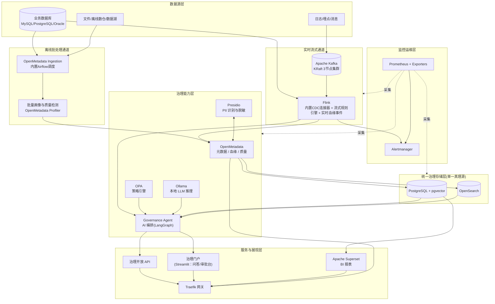
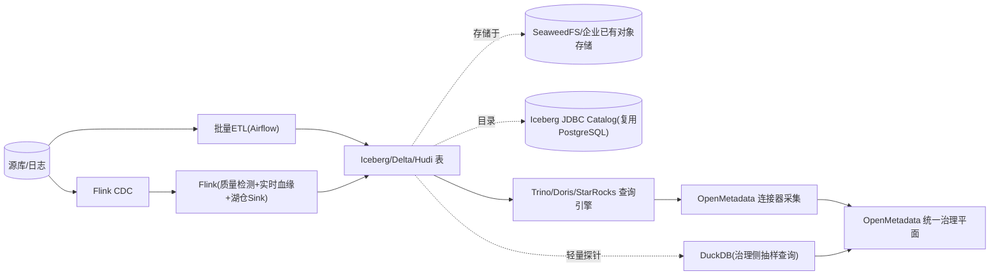

# AI 数据治理平台设计方案（开源单机优先版）v3.0

> 文档定位：默认以单机 Docker Compose 作为起步与验证路径（见6.3），覆盖离线批处理与实时流式两类场景；当规模超出单机容量上限（见4.1.2）或需要真正高可用时，文档同时提供 3 节点 k3s 高可用扩展路径（见6.2）。**v3.0 相对 v2.0 的调整**：①默认部署路径从"3节点优先"改回"单机优先，按需升级到 3 节点"；②实时链路改用 Flink CDC 直连捕获，移除 Debezium+Kafka Connect 独立组件，降低单机资源占用与运维复杂度。

## 0. 需求响应对照表

| # | 原始需求 | 设计响应 | 对应章节 |
|---|---|---|---|
| 1 | 组件用开源组件、主流方案 | 全部选型来自 Apache/CNCF/知名活跃社区项目；逐一核查 OSI 许可证，剔除 BSL/SSPL/多租户限制等"伪开源"陷阱 | 第3章 |
| 2 | 可单机部署（v3.0 恢复为默认路径） | 默认采用单机 Docker Compose 部署（见6.3），验证通过后若超出 4.1.2 单机容量上限或需要真正高可用，可按需升级到 6.2 的 3 节点 k3s 方案 | 第6章 |
| 3 | 可落地场景 | 给出5个可直接复制的落地场景，覆盖资产/血缘/质量/安全/AI五大治理能力域 | 第6章 |
| 4 | 考虑性能、可靠 | 容量分级规划、性能优化清单、单机/3节点两套可靠性设计、监控告警与灾备 | 第5章 |
| 5 | 支持离线和实时 | 双通道架构（批处理+流式），统一元数据底座作为唯一真理源，避免"两套血缘/两套质量结果"打架 | 第4章 |

---

## 1. 总体架构



**关键设计决策**：
- **各能力的用户界面优先复用组件自带 UI**，仅在确实缺失时轻量自建：数据目录/血缘/质量用 OpenMetadata 自带 UI，BI 报表用 Superset，批处理/流处理监控用 Airflow/Flink 自带 Dashboard；Governance Agent 的智能问答（场景D）与访问审批（场景E）之前只有 API 没有界面，新增轻量治理门户（Streamlit）补齐，完整盘点见 2.4。
- **血缘/质量/资产的唯一真理源是 OpenMetadata + PostgreSQL**。无论数据来自离线批处理还是实时流，最终都写入同一套元数据存储，不再出现"两个数据源不同步"的问题（历史上 DataHub/OpenMetadata + 独立图数据库并存导致过这类问题，本方案直接规避）。
- **Flink 作为实时流处理核心引擎**：承担有状态窗口计算、复杂规则/CEP，以及通过官方 OpenLineage 集成生成实时血缘事件；相比在 Governance Agent 里手写消费者重新实现窗口/状态管理，直接用 Flink 更贴合"主流方案"要求，也更可靠（原生 Checkpoint 容错）。单机模式下单节点 standalone 部署即可；3 节点模式下由 Flink Kubernetes Operator 管理，JobManager 获得 K8s 原生选举 HA。
- **实时链路改用 Flink CDC 直连捕获，移除 Debezium+Kafka Connect 独立组件**：Flink CDC（现为 Apache Flink 官方子项目 `apache/flink-cdc`，Apache-2.0）内置 MySQL/PostgreSQL/Oracle 等 CDC Source Connector，直接在 Flink 作业内读取源库变更，无需再单独部署 Kafka Connect 运行 Debezium；Kafka 的职责收窄为承接日志类事件接入与 `governance.alerts` 告警分发，不再承担 CDC 传输职责，减少一个独立组件与其运维负担（详见3.3）。
- **Governance Agent 收窄为 AI 编排与服务层**：不再自己实现流式规则引擎，改为订阅 Flink 产出的告警/结果做 AI 层面增强（异常摘要、根因线索、处置建议），并承担开放 API、审批网关等职责，分工更清晰。
- **Apache Superset 作为治理 BI 层**：直接对接 PostgreSQL，将资产覆盖率、质量趋势、告警趋势等治理指标可视化，服务于管理层/治理团队的常态化监控。
- **Governance Agent 是唯一自研组件**，内部按模块划分（实时告警增强模块 / AI 编排模块 / 开放 API 模块 / 审批网关模块），早期阶段合并部署为一个服务，未来可按模块拆分独立扩展。
- **物理部署默认单机，规模化后可按需升级 3 节点高可用**：本图是逻辑架构，与部署在 1 台还是 3 台服务器无关；单机 Docker Compose（6.3，默认起步）与 3 节点 k3s（6.2，规模化后可选）共用同一套逻辑架构，角色分工、副本策略、编排工具差异见第6章。

---

## 2. 核心组件选型与开源协议核查

### 2.1 核心必需组件

| 组件 | 承担能力 | 开源协议 | 许可证说明 |
|---|---|---|---|
| PostgreSQL + pgvector | 元数据库、向量库（一库多用） | PostgreSQL License / PostgreSQL License(类MIT) | 无商用限制 |
| OpenSearch | 全文检索、OpenMetadata 存储引擎 | Apache-2.0 | AWS 主导的 Elasticsearch 开源分支 |
| OpenMetadata（server + ingestion，内置 Airflow） | 元数据目录、血缘、内置数据质量测试/画像 | Apache-2.0 | 官方 docker-compose quickstart 最低 4 容器、6GiB 内存 + 4vCPU 即可单机运行 |
| sqllineage（作为 ingestion 内嵌库，非独立服务） | 复杂 SQL 脚本血缘解析，补充 OpenMetadata 原生解析 | MIT | 已核实 |
| Presidio（analyzer + anonymizer） | PII 识别与脱敏 | MIT | 微软出品，已核实 |
| Open Policy Agent（OPA） | 策略即代码、访问控制/审批规则 | Apache-2.0 | 已核实 |
| Ollama | 本地 LLM 推理引擎 | MIT | Ollama 本身 MIT，所加载模型许可证需单独核查 |
| Qwen2.5 / Qwen3（默认模型） | 问答、脱敏建议、影响分析生成 | Apache-2.0 | 中文场景主流、商用友好，优于 Llama 系列的社区许可证 |
| BGE-M3 / nomic-embed-text | 向量嵌入模型（RAG 用） | MIT / Apache-2.0 | 经 Ollama 或 sentence-transformers 加载 |
| LangChain / LangGraph | AI 编排框架 | MIT | 代码优先、可控性强，作为主推荐（而非 Dify） |
| Governance Agent（自研） | AI 编排、开放 API、审批网关、消费 Flink 输出做智能增强 | 自有 | 唯一自研组件，模块化设计 |
| 治理门户前端（自研，基于 Streamlit） | 场景D智能问答聊天界面、场景E访问审批台，调用 Governance Agent API | Apache-2.0（Streamlit） | 曾评估 Open WebUI，其许可证含"禁止修改/移除品牌"附加条款，非纯 OSI 开源（见2.3），改用无此类限制的 Streamlit 自建轻量前端 |
| Apache Kafka（KRaft 模式，3节点集群） | 日志类事件接入 + 告警事件分发基础设施 | Apache-2.0 | KRaft 自 3.3 起 GA，无需 ZooKeeper；3节点部署通过 Strimzi Operator 管理，副本因子 3；不再承担 CDC 传输（见 Flink 行） |
| Apache Flink（Kubernetes 部署，内置 Flink CDC）| 实时流处理引擎：内置 CDC Source Connector 直连捕获数据库变更、有状态窗口计算、复杂规则、实时血缘事件生成 | Apache-2.0 | Flink CDC 现为 Apache Flink 官方子项目（apache/flink-cdc），内置 MySQL/PostgreSQL/Oracle 等连接器，免去独立部署 Kafka Connect+Debezium；OpenLineage 官方支持 Flink 集成；通过 Flink Kubernetes Operator 管理，JobManager HA 依赖 K8s 原生选举，无需 ZooKeeper |
| PgBouncer | 数据库连接池 | ISC（宽松许可） | 性能优化必需 |
| Traefik | 反向代理、统一网关、TLS 终止 | MIT | k3s 默认内置的 Ingress Controller，配合 MetalLB 提供跨节点漂移的虚拟 IP |
| Prometheus + node_exporter + cAdvisor + postgres_exporter + kafka_exporter | 指标采集与监控 | Apache-2.0 | 通过 kube-prometheus-stack Helm Chart 统一安装 |
| Alertmanager | 告警路由与去重 | Apache-2.0 | |
| Apache Superset | BI 报表与治理可视化大盘 | Apache-2.0 | 替代 Metabase/Grafana OSS（均 AGPL-3.0），数据源直接对接 PostgreSQL |
| k3s | 轻量 Kubernetes 发行版，3 节点集群编排底座 | Apache-2.0 | 单二进制、内置 etcd，专为少节点 HA 场景设计 |
| Helm | k3s 组件包管理与安装 | Apache-2.0 | |
| CloudNativePG | PostgreSQL 高可用 Operator | Apache-2.0 | 1主2从自动故障转移，复用 K8s API 协调，无需额外部署 etcd |
| Strimzi | Kafka Kubernetes Operator | Apache-2.0 | 管理 3 broker+controller 合一节点，副本因子 3 |
| OpenSearch Kubernetes Operator | OpenSearch 集群编排 | Apache-2.0 | 官方维护，管理 3 节点集群的扩缩容与故障恢复 |
| Flink Kubernetes Operator | Flink 作业与 HA 管理 | Apache-2.0 | JobManager HA 用 K8s 原生选举，无需 ZooKeeper |
| MetalLB | 裸金属 LoadBalancer | Apache-2.0 | 为 Traefik Ingress 提供跨节点漂移的虚拟 IP，消除入口单点 |

### 2.2 触发式可选扩展（默认不启用，达到特定条件再引入）

| 组件 | 引入条件 | 开源协议 | 备注 |
|---|---|---|---|
| Great Expectations 或 Soda Core | OpenMetadata 内置质量测试无法表达复杂规则 | Apache-2.0 | 二选一，避免同时引入造成技术栈分裂 |
| Grafana | 需要比 Prometheus 自带 UI 更丰富的运维大盘 | AGPL-3.0 | **仅限内部运维可视化**；若平台未来对外提供多租户 SaaS 服务，AGPL 的网络访问条款需法务复核（与 Dify 多租户条款问题同类处理原则） |
| Valkey | 出现明显的元数据查询热点、需要缓存层 | BSD-3-Clause | 替代 Redis（≥7.4 起默认 RSALv2/SSPLv1，非 OSI 开源） |
| NebulaGraph | 需要超出 OpenMetadata 内置血缘表达能力的多跳图算法分析 | Apache-2.0 | 不作为核心必需，避免血缘"两个真理源"问题 |
| Milvus | pgvector 向量规模超过千万级、检索延迟不达标 | Apache-2.0 | 单机场景通常无需集群模式 |
| SeaweedFS | 需要 S3 兼容对象存储（含承载湖仓表文件） | Apache-2.0 | 替代 MinIO（主分支已改 AGPL-3.0）；生产规模湖仓存储通常独立扩展或复用企业已有对象存储 |
| Apache Iceberg | 企业已有/规划建设开放表格式湖仓架构 | Apache-2.0 | 生态最广，默认推荐；OpenMetadata 无原生连接器，需经 Trino/Doris/StarRocks 等查询引擎间接采集元数据与血缘 |
| Delta Lake | 同上，且希望 OpenMetadata 直接原生连接 | Apache-2.0 | OpenMetadata 官方专用连接器，无需查询引擎中转 |
| Apache Hudi | 同上，且有高频 upsert/近实时写入需求 | Apache-2.0 | 同 Iceberg，需经查询引擎间接接入，OpenMetadata 无原生连接器 |
| Trino（单节点） | 湖仓场景下需要采集 Iceberg/Hudi 元数据，或治理侧需要 SQL 抽样查询 | Apache-2.0 | 若企业已有 Doris/StarRocks 承担分析职责可直接复用，无需重复部署 |
| DuckDB | 治理侧对湖仓表做轻量抽样查询（PII 扫描、RAG 检索取数） | MIT | 内嵌式，无需服务化部署 |
| Apache Polaris 或 Hive Metastore | 湖仓需要多引擎并发读写、JDBC Catalog 并发能力不够 | Apache-2.0 | Catalog 服务化升级，默认走 Iceberg JDBC Catalog 复用 PostgreSQL 即可 |
| Dify | 业务方明确要低代码编排、且法务确认非多租户 SaaS 场景 | Apache-2.0 + 附加条款 | 附加条款限制未授权的多租户运营 |
| MLflow | 需要正式的模型注册/上线审批流程 | Apache-2.0 | 开源版审批能力弱，审批网关需自研补齐 |
| Keycloak | 企业无现成 IdP/SSO，需自建统一身份认证 | Apache-2.0 | 优先对接企业已有 AD/LDAP/SSO，无现成时才自建，见2.5 |
| oauth2-proxy | 需要统一 SSO 覆盖 Flink/Prometheus/Traefik 等无原生认证的 UI | MIT | 作为 Traefik ForwardAuth 中间件，CNCF Sandbox 项目，见2.5 |

### 2.3 明确不采用/需谨慎的组件

| 组件 | 问题 |
|---|---|
| Redpanda | 核心采用 Source Available（BSL 类）许可，非 OSI 认证开源，与需求1"开源组件"冲突，不作默认推荐，仅在用户明确接受非纯开源许可时才可考虑 |
| Apache Ranger | 官方定位是 Hadoop 生态安全框架，对 Doris/ClickHouse 等无官方插件，本方案改用 OPA 统一做策略引擎 |
| MinIO（主分支） | 已改 AGPL-3.0 |
| Redis ≥7.4 | 默认 RSALv2/SSPLv1，非 OSI 开源 |
| Open WebUI | 许可证表面类似 BSD-3-Clause，但附加条款明确禁止修改/移除“Open WebUI”品牌，与 Dify 附加条款同类问题，非纯 OSI 开源，改用 Streamlit 自建前端（见2.1） |

---

### 2.4 用户界面（UI）覆盖盘点

本节回答“最终平台是否有 UI”：结论是**有**，且绝大多数能力直接复用组件自带 UI，仅 Governance Agent 自研能力（场景D/E）需要新增一个轻量前端。

| 能力域 | UI 来源 | 现状 |
|---|---|---|
| 数据目录/血缘/质量浏览 | OpenMetadata 自带 UI | ✅ 齐全，无需自建 |
| PII 标签人工复核（场景A 中置信队列） | OpenMetadata 自带 Tasks / Request-for-Tags 工作流 | ✅ 直接复用，无需新建 |
| BI 报表/治理指标看板 | Apache Superset 自带 UI | ✅ 齐全 |
| 批处理调度监控 | Airflow 自带 UI（随 OpenMetadata ingestion 内置） | ✅ 齐全 |
| 实时流作业监控 | Flink 自带 Web Dashboard | ✅ 齐全 |
| 基础设施/集群监控 | Prometheus/Alertmanager 基础 UI；Grafana 可选更丰富 | ✅ 基本齐全（可选增强） |
| 网关/入口路由 | Traefik 自带 Dashboard（可选开启） | ✅ 可选 |
| AI 智能问答（场景D） | 治理门户（自研 Streamlit 聊天界面） | ⚠️ 之前缺失，本轮补齐 |
| 敏感数据访问审批（场景E） | 企业 IM 审批（企业微信/钉钉/飞书）卡片，或治理门户审批台兼底 | ⚠️ 之前缺失，本轮补齐 |
| OPA 策略编写 | 无 UI，Rego 代码 + Git 版本管理 | ⚪ 设计上故意如此（策略即代码） |

**结论**：平台本身不重复建设 UI，除了把已有组件的 UI 串连起来之外，仅为 Governance Agent 新增一个轻量治理门户（Streamlit）承载场景D的聊天问答与场景E的审批台，避免为此引入非纯开源的第三方 Chat UI（如 Open WebUI）。

### 2.5 统一入口与单点登录（回答"有没有统一的治理 UI"）

延续 2.4 的盘点：**目前没有单一 UI 合并所有能力，而是多个专业 UI 各自入口**。是否需要"统一"取决于对"统一"的定义——若指"一次登录、一个起始入口"，可以补齐；若指"重新做一套 UI 取代所有工具自带界面"，不建议（重复造轮子，且各工具原生 UI 已经很成熟）。

**统一登录（SSO/OIDC）**：

| 组件 | 是否原生支持 OIDC | 接入方式 |
|---|---|---|
| OpenMetadata | 是 | 直接配置 OIDC Provider |
| Apache Superset | 是（基于 Flask-AppBuilder） | 直接配置 OAuth/OIDC |
| Airflow | 是（基于 Flask-AppBuilder） | 直接配置 OAuth/OIDC |
| 治理门户（Streamlit，自研） | 需自行集成 | 开发时直接对接 OIDC |
| Flink Dashboard / Prometheus / Alertmanager / Traefik Dashboard | 否，无原生认证 | 经 oauth2-proxy 作为 Traefik ForwardAuth 中间件统一网关认证 |

身份提供方（IdP）优先对接企业已有 AD/LDAP/内部 SSO；若企业没有现成 IdP，才自建 Keycloak（Apache-2.0，触发式可选，见2.2）。

**统一入口（导航 launcher）**：治理门户（Streamlit）除原有问答/审批功能外，扩展为登录后的**首页/导航中心**：展示各能力入口卡片（资产目录→OpenMetadata、BI报表→Superset、实时作业→Flink、批处理→Airflow），点击后在同一 SSO 会话下深链接跳转；不做 iframe 完整嵌入（各工具都有较强的 CSP/frame-ancestors 限制，嵌入不可靠，直接跳转更稳定）。

**结论**：可以做到"一次登录 + 一个起始地址"的统一体验，但不做"单一 UI 取代所有 UI"，这是权衡工程投入与用户体验后的合理选择。

---

## 3. 离线与实时双链路设计

### 3.1 两类通道特征对比

| 维度 | 离线批处理通道 | 实时流式通道 |
|---|---|---|
| 延迟 | 分钟~小时级（按 Airflow 调度周期） | 秒级~亚秒级 |
| 一致性 | 强一致，全量/增量核对，适合审计 | 最终一致，允许短暂延迟，适合监控告警 |
| 典型场景 | 全量资产盘点、周期性合规审计、历史数据画像、复杂 SQL 血缘解析 | 交易异常检测、实时血缘登记、实时告警、访问策略实时评估 |
| 故障影响 | 影响下一周期结果，存量数据不受影响 | 短暂中断不影响历史数据；Kafka 保留窗口内事件可重放；批处理兜底校准 |
| 数据量级特征 | 大批量、高吞吐、周期性峰值 | 小批量高频、持续稳定流量 |

### 3.2 离线批处理链路

1. **抽取**：OpenMetadata Ingestion 连接器定期（默认每日，可配置）连接业务数据库/数据仓库，抽取 schema、样本数据、既有 SQL 脚本。
2. **画像与质量**：OpenMetadata 内置 Profiler 生成列级统计（空值率、唯一值、分布），内置质量测试（Data Quality Tests）执行规则校验；复杂规则不够用时才引入 Great Expectations/Soda Core。
3. **血缘解析**：OpenMetadata 原生连接器血缘 + sqllineage 解析复杂 ETL/视图 SQL 脚本，统一写入 OpenMetadata 血缘图。
4. **敏感数据发现**：Presidio Analyzer 对抽样数据批量扫描，按置信度分层处理（见第6章场景A）。
5. **产出**：资产目录、血缘图、质量报告、PII 标签，全部落地在 PostgreSQL/OpenSearch。

### 3.3 实时流式链路

1. **捕获（Flink CDC 直连，无需独立 Kafka Connect）**：在 Flink 作业内直接使用 Flink CDC 的 MySQL-CDC/Postgres-CDC/Oracle-CDC Source Connector 订阅业务数据库的 binlog（MySQL）/逻辑复制（PostgreSQL WAL）/redo log（Oracle 需商业插件，注意授权），直接产生行级变更事件流，不再需要单独部署 Kafka Connect 运行 Debezium。
2. **日志类事件接入**：应用层的日志/埋点事件（非数据库 CDC）仍通过 Kafka（KRaft 部署，无需 ZooKeeper）接入，Flink 作为 Kafka 消费者读取。
3. **流式处理（Flink）**：同一个 Flink 作业合并处理 CDC 直连流与 Kafka 日志流，执行：
   - 有状态窗口计算（滑动/滚动窗口内空值率突增、字段越界、行数环比骤降等）；
   - 复杂事件关联（多表联合异常检测等 CEP 场景，为后续增强预留能力）；
   - 通过官方 OpenLineage Flink 集成自动生成实时管道血缘事件，直接写入 OpenMetadata 血缘 API——**与离线血缘共享同一存储，不产生第二套真理源**；
   - 质量检测结果写入 OpenMetadata；异常事件发送到独立 Kafka Topic（如 `governance.alerts`）供下游消费。
4. **AI 增强与处置（Governance Agent）**：订阅 `governance.alerts` Topic，调用 Ollama 对异常做补充解释（摘要、可能根因、历史相似问题匹配），并按严重程度触发 Alertmanager/IM 告警或联动 OPA 执行自动降级策略。
5. **背压与容错**：Flink CDC 的 binlog/WAL 位点与 Flink 自身 Checkpoint 绑定一起持久化（状态与位点定期落本地磁盘），保证节点重启后可从最近 Checkpoint 恢复，避免重复处理或漏处理（相比 Debezium+Kafka Connect 方案需要另外管理 Kafka Connect 自己的 offset，单一 Checkpoint 机制更简洁）；Kafka 配置合理的 topic 保留时长（建议 ≥7 天）用于日志事件重新回放；Governance Agent 对 `governance.alerts` 的消费同样采用 at-least-once + 幂等写入（业务主键+时间戳去重）。

### 3.4 统一治理平面与降级策略

- 离线和实时两条链路的最终写入目标是**同一个 OpenMetadata + PostgreSQL/OpenSearch**，用户在同一个界面/API 查询资产、血缘、质量结果，无需区分数据来自哪条通道。
- 当实时链路故障（Kafka/Flink CDC 捕获/Governance Agent 消费者不可用）时，离线批处理仍按周期运行，作为质量/血缘结果的兜底来源，保证核心治理能力不因实时组件故障而完全失效。

### 3.5 湖仓一体场景扩展（触发式：企业已有或规划建设湖仓架构时启用）

湖仓一体（数据湖+数据仓库融合）不是本方案的默认必需能力，而是作为**数据源类型的扩展**接入统一治理平面——当企业的数据除了传统业务数据库外，还有基于开放表格式（Iceberg/Hudi/Delta Lake）的湖仓时触发。

**表格式选择**（三选一或按需组合，均为 Apache-2.0）：

| 表格式 | 适用场景 | OpenMetadata 治理接入方式 |
|---|---|---|
| Apache Iceberg | 生态最广、与 Doris/StarRocks/Trino 等主流 OLAP 引擎原生集成最好，默认推荐 | **需经查询引擎间接接入**：OpenMetadata 无独立 Iceberg 原生连接器，需连接 Trino/Doris/StarRocks/Presto/Athena（均有官方连接器）来采集元数据与血缘 |
| Delta Lake | 希望 OpenMetadata **直接原生连接**、免去额外查询引擎中转 | OpenMetadata 官方专用 Delta Lake 连接器，可直连 |
| Apache Hudi | 高频 upsert/近实时写入场景更成熟 | 同 Iceberg，需经查询引擎间接接入，OpenMetadata 无原生连接器 |

以上结论已通过查阅 OpenMetadata 官方连接器文档核实（Delta Lake 在官方 Database 连接器列表中，Iceberg/Hudi 不在），避免凭印象误判。

**目录（Catalog）**：默认使用 Iceberg JDBC Catalog，复用核心组件 PostgreSQL（新建独立 schema，零新增服务，延续"一库多用"原则）；当需要多引擎（Spark+Trino+Flink+Doris）并发读写、更强的多表事务/并发保证时，可升级为 Apache Polaris（Apache-2.0，Iceberg REST Catalog 参考实现）或 Hive Metastore（Apache-2.0）。

**对象存储**：单机 POC 可部署 SeaweedFS（Apache-2.0，S3 兼容）承载表文件；生产规模的湖仓存储通常是独立扩展的存储层或企业已有的 MinIO/Ceph/云 OSS，治理平台此时只需只读凭证接入，不必自己托管。

**查询引擎（治理与分析共用）**：默认新增 Trino 单节点（standalone，服务于"OpenMetadata 元数据采集 + Governance Agent/Presidio 抽样查询"）；若企业已有 Doris/StarRocks 承担分析职责且已挂载 Iceberg Catalog，直接复用其作为 OpenMetadata 连接目标，无需重复部署 Trino。

**离线入湖**：批量 ETL（沿用 3.2 的 Airflow 调度）定期把源库/日志数据写入 Iceberg/Delta 表；OpenMetadata 照常抽取 schema、分区、统计信息。

**实时入湖（复用现有 Flink 作业，不新增管道）**：3.3 中已经存在的 Flink 流式作业，在原有"质量检测 + 实时血缘事件"输出之外，新增一个 Iceberg/Hudi/Delta Sink，将 CDC 流以近实时 upsert 方式写入湖仓表——同一个作业身兼质量监控与建仓两件事，避免为"实时入湖"另起一条数据管道。

**治理侧轻量查询**：Governance Agent/Presidio 对湖仓表做 PII 抽样或 RAG 检索（场景D）的数据获取时，直接用 DuckDB（MIT，内嵌式，原生支持读 Iceberg/Delta/Parquet 文件）做轻量查询，无需为这类内部辅助查询单独跑一个服务化查询引擎。

**PII 与访问控制在湖仓侧的落地**：Presidio 批量扫描结果、OPA 策略决策的口径与其他数据源一致（见2.1、5章场景A/E），执行点落在查询引擎侧——Trino 支持基于视图的列级脱敏，Doris/StarRocks 有自身的列级权限体系，需按引擎分别配置，但决策依据统一来自 OpenMetadata 的 PII 标签 + OPA 策略。

**容量说明**：湖仓底层数据卷通常远大于传统业务库，但**不计入本文第4章的容量规划**（该规划以"表数量"衡量元数据治理负载，与实际数据体量无关）；若单机同时部署 SeaweedFS 承载湖仓存储，需要为存储容量单独规划磁盘（取决于业务数据量而非表数量），不与治理平台自身的资源预算混算。



---

## 4. 性能与可靠性设计（NFR）

### 4.1 容量规划分级（工程经验估算，实施前需实测压测校准）

#### 4.1.1 三节点高可用模式容量规划（规模化后的扩展路径，部署方式见6.2）

| 规模档位 | 表数量 | 日增数据量 | 实时事件吞吐 | 并发用户 | 每节点建议规格（×3台，对称部署） |
|---|---|---|---|---|---|
| 小型（部门级生产） | < 1,000 | < 10GB | < 100 events/s | < 20 | 16 vCPU / 64GB RAM / 1TB NVMe SSD ×3 |
| 中型（多业务线共享） | 1,000 ~ 10,000 | 10 ~ 100GB | 100 ~ 2,000 events/s | 20 ~ 100 | 24 vCPU / 96GB RAM / 2TB NVMe SSD ×3 |
| 大型（企业级） | 10,000 ~ 20,000 | 100GB~500GB | 2,000 ~ 5,000 events/s | 100 ~ 200 | 32 vCPU / 128GB RAM / 4TB NVMe ×3（Ollama 建议用 nodeAffinity 固定在其中1台并加装 GPU） |

> **容量口径说明**：PostgreSQL/OpenSearch/Kafka 均做 3 副本，每节点磁盘按"完整数据量"规划而非"数据量/3"（每个副本都是全量拷贝）；每节点规格已预留约 30% 冗余，用于吸收其他节点故障时临时承接的负载。
> **集群上限提示**：超过"大型"档位（表数量>2万、吞吐>5,000 events/s、并发>200）时，建议扩容为 5 节点+（增加 Kafka/OpenSearch 副本与专用节点池），而非继续增大单节点规格。

#### 4.1.2 单机模式容量规划（默认起步路径，部署方式见6.3）

| 规模档位 | 表数量 | 日增数据量 | 实时事件吞吐 | 并发用户 | 建议单机规格 |
|---|---|---|---|---|---|
| 小型（POC/试点） | < 1,000 | < 10GB | < 100 events/s | < 20 | 8 vCPU / 32GB RAM / 500GB SSD（仅离线闭环，暂不含 Kafka/Flink/Superset） |
| 中型（部门级生产） | 1,000 ~ 10,000 | 10 ~ 100GB | 100 ~ 2,000 events/s | 20 ~ 100 | 24 vCPU / 96GB RAM / 2TB NVMe SSD（离线+实时完整链路，含 Flink+Superset） |
| 大型（多业务线共享） | 10,000 ~ 20,000 | 100GB~500GB | 2,000 ~ 5,000 events/s | 100 ~ 200 | 48 vCPU / 192GB RAM / 4~8TB NVMe（Ollama 如需更大模型建议加装 GPU；Flink 作业数增多需相应加大内存） |

> **单机上限提示**：表数量超过 2 万、实时事件吞吐超过 5,000 events/s 或并发用户超过 200 时，建议升级到 4.1.1 的三节点高可用模式。单机模式设计上限即在此，不建议继续堆资源。

#### 4.1.3 最小测试环境规格（功能验证专用，测试服务器资源有限时使用）

若测试环境服务器规格低于 4.1.2 的"小型"档位，可按以下**功能可跑通的绝对下限**评估，仅用于功能联调/验收测试，不代表可承载真实业务负载，**不能用于压测、不能带入生产**：

| 验证范围 | CPU | 内存 | 磁盘 | 说明 |
|---|---|---|---|---|
| 仅离线治理 + AI（暂不启用实时链路） | 8 vCPU | 16GB RAM | 200GB SSD | 对应先验证执行计划 Phase 1+3，Phase 2 实时链路延后 |
| 全链路（含 Kafka/Flink/Superset） | 12 vCPU | 24GB RAM | 300GB SSD | 全部核心组件跑通，仅做功能验证，无性能/可靠性余量 |

**进一步压缩资源的具体手段**（仅限测试环境，生产环境不要沿用）：
- Ollama 改用更小模型（如 Qwen2.5:1.5b/3b 量化版）替代 7B，可省 4~12GB 内存，代价是问答质量下降，仅适合功能联调，不适合验证准确率；
- OpenSearch/Kafka 手动调小 JVM heap（如 OpenSearch `-Xms1g -Xmx1g`、Kafka `KAFKA_HEAP_OPTS=-Xms512m -Xmx512m`）；
- Flink `taskmanager.numberOfTaskSlots` 调到 1~2，只验证规则逻辑是否跑通，不代表真实吞吐能力；
- 暂不部署 Prometheus/Superset，先用 OpenMetadata/Flink 自带 Web UI 做功能验证，功能跑通后再按需加回监控和 BI；
- OpenSearch/Kafka 均用单节点、不开副本，这是测试专用配置。

**与 3 节点高可用模式的取舍**：3 节点模式无论如何都需要 3 台服务器各自跑一份完整副本，总资源需求天然是单机模式的数倍；测试环境资源有限时**不建议**用 3 节点模式练习，应先用本节的单机最小配置验证功能，等测试环境资源充足或进入预生产阶段再验证 3 节点的高可用能力。

### 4.2 单容器资源基线（单机模式参考值；3节点模式下为每个副本 Pod 的资源配置）

| 服务 | CPU | 内存 | 说明 |
|---|---|---|---|
| PostgreSQL(+pgvector) | 2 vCPU | 4GB | 随数据量增长需扩容磁盘 |
| OpenSearch（单节点） | 2 vCPU | 8GB | 官方建议 JVM heap ≥4GB |
| OpenMetadata server | 2 vCPU | 4GB | |
| OpenMetadata ingestion（内置 Airflow） | 2 vCPU | 4GB | |
| Presidio analyzer | 1 vCPU | 2GB | |
| Presidio anonymizer | 0.5 vCPU | 1GB | |
| OPA | 0.5 vCPU | 512MB | Go 二进制，极轻量 |
| Ollama（CPU 推理 7B 量化模型） | 4~8 vCPU | 8~16GB | 有 GPU 则显著提速，AI 场景吞吐更稳定 |
| Governance Agent | 2 vCPU | 4GB | |
| Kafka（KRaft 单节点） | 2 vCPU | 4GB | JVM heap ~2GB + 页缓存 |
| Flink（JobManager+TaskManager，单节点 standalone，内置 Flink CDC） | 2~4 vCPU | 4~8GB | 规则/窗口越多需要越多内存；Checkpoint 建议落本地盘；已包含 CDC 连接器，无需额外 Kafka Connect 进程 |
| PgBouncer | 0.25 vCPU | 256MB | |
| Traefik | 0.5 vCPU | 256MB | |
| Prometheus + Alertmanager + Exporters | 1.5 vCPU | 3GB | |
| Apache Superset | 1 vCPU | 2GB | |
| 治理门户（Streamlit） | 0.5 vCPU | 512MB | |

> 在 3 节点高可用模式下，上表数值即为 CloudNativePG/Strimzi/OpenSearch Operator/Flink Operator 为每个副本 Pod 分配的资源请求（每节点各跑一份）；无状态服务（OpenMetadata server、Presidio、OPA、Governance Agent、Superset 等）按同表数值在 3 节点间调度分布，无需每节点都部署一份全量。

### 4.3 性能优化清单

- **连接池**：所有服务经 PgBouncer 访问 PostgreSQL，避免连接数暴涨拖垮数据库。
- **索引与分区**：高频查询字段建索引；元数据表随规模增长按时间/业务线做表分区；OpenSearch 合理规划 shard 数量（单 shard 建议控制在 10~50GB）。
- **Kafka 分区规划**：Topic 分区数与 Flink 消费并行度（Task Slot 数）对齐，避免分区过多导致 Kafka 元数据开销增大，或分区过少导致消费瓶颈。
- **缓存热点元数据**：高频访问的资产目录/血缘查询结果可加一层 Valkey 缓存（触发式引入，见2.2）。
- **AI 推理批处理**：Ollama 请求做并发限流与批处理，避免大模型推理拖慢实时告警链路；对延迟敏感的实时规则检测不依赖 LLM，仅用确定性规则。
- **分页与增量 API**：Governance Agent 对外 API 全部分页返回，避免全量拉取拖垮元数据库。

### 4.4 可靠性设计（3节点高可用场景）

3 节点通过 k3s + Operator 实现真正的多副本高可用，可**容忍任意 1 个节点故障**而不中断服务；但仍需清楚记录残余风险，而非假装故障不存在：

- **故障容忍边界**：etcd（k3s 控制面）、Kafka（KRaft quorum）、CloudNativePG 均基于"多数派"机制，3 副本最多容忍 1 个节点同时故障；若 2 个节点同时故障，集群会丧失写入能力（这是 3 节点拓扑的固有上限，需要更高可用性时应扩容到 5 节点）。
- **自动故障转移**：
  - PostgreSQL：CloudNativePG 检测到主库所在节点故障后，自动提升一个从库为新主库；
  - OpenSearch：OpenSearch Operator 自动重新选主、重新分配分片副本；
  - Kafka：Strimzi 管理的 broker 故障后，分区 leader 自动切换到其他副本 broker；
  - Flink：JobManager 故障后由 Flink Kubernetes Operator 触发重新调度，作业从最近 Checkpoint 恢复；
  - 无状态服务（OpenMetadata server、Presidio、OPA、Governance Agent、Superset）由 K8s 自动将 Pod 重新调度到健康节点。
- **数据备份**（多副本不能替代备份，仍需独立留存离线副本）：
  - PostgreSQL：CloudNativePG 内置 WAL 归档 + Barman Cloud 定期全量备份，支持时间点恢复（PITR）；
  - OpenSearch：定期 snapshot 到独立对象存储；
  - Kafka：核心 Topic 配置合理保留时长，Schema/Topic 定义纳入 IaC 版本管理；
  - Flink：Checkpoint/Savepoint 目录纳入定期备份。
- **配置即代码**：k3s 安装脚本、Helm values、Kafka Topic 定义、OPA 策略、OpenMetadata 连接器配置全部纳入 Git 版本管理，实现"重建而非修复"的快速恢复能力。
- **资源隔离**：Pod 级 CPU/内存 requests/limits，配合 PodDisruptionBudget 防止单一组件（如 Ollama 推理峰值）挤占其他核心服务资源，也避免节点维护时一次性驱逐过多副本导致服务中断。
- **优雅降级**：实时链路故障时离线批处理兜底（见3.4）；OPA 策略引擎不可用时默认拒绝高风险操作而非放行（fail-closed，而非 fail-open）。
- **入口单点的消除**：MetalLB 为 Traefik Ingress 提供跨节点漂移的虚拟 IP，避免"入口所在节点故障=整个平台不可访问"。
- **升级路径**：超出 3 节点容量上限后，扩容为 5 节点+（提高 Kafka/OpenSearch 副本数、拆分专用节点池），作为既定预案而非事后现想。

### 4.5 监控告警与 SLO 示例

| 监控项 | 采集方式 | 建议 SLO |
|---|---|---|
| 元数据同步延迟（离线） | Airflow/OpenMetadata ingestion 任务耗时 | 单次全量同步 < 调度周期的 50% |
| 实时管道端到端延迟 | Kafka consumer lag + 自定义埋点 | P95 < 30 秒 |
| 数据质量检测覆盖率 | OpenMetadata 质量测试执行数/资产总数 | 核心资产覆盖率 > 90% |
| 系统资源水位 | node_exporter/cAdvisor | CPU < 80%、内存 < 85% 持续告警 |
| 备份成功率 | 备份脚本退出码 + Prometheus pushgateway | 100%（失败即时告警） |
| Kafka 消费滞后 | kafka_exporter | lag 持续增长 5 分钟以上告警 |

### 4.6 灾备

- 建议 RPO（可容忍数据丢失） ≤ 1 小时（依赖 WAL 归档频率），RTO（恢复时间目标） ≤ 4 小时（依赖备份介质读取速度与重建自动化程度）。
- 每季度至少执行一次真实的备份恢复演练，而非只验证备份任务"跑成功"。

---

## 5. 落地场景

| 场景 | 通道 | 触发条件 | 核心流程 | 产出/价值 | 涉及组件 |
|---|---|---|---|---|---|
| A. 全量数据资产盘点与敏感数据发现 | 离线 | 新数据源接入 / 周期性全量扫描 | Ingestion 抽取 schema+样本 → Presidio 批量扫描 → **按置信度分层**（高置信自动打标签+建议脱敏策略，中置信通过 OpenMetadata 原生 Tasks/Request-for-Tags 工作流生成人工复核任务，低置信仅记录不打扰人工）→ 写入资产目录+PII 标签 → OPA 生成访问策略建议 | 资产目录覆盖率、敏感字段清单、脱敏策略建议；复核复用 OpenMetadata 自带界面，无需新建 UI | OpenMetadata、Airflow、Presidio、OPA |
| B. 实时交易/业务数据质量监控与异常告警 | 实时 | 业务库产生变更 | Flink CDC 直连捕获变更 → Flink 流式规则引擎评分（空值率突增/范围越界/行数环比骤降）→ 命中阈值写入质量结果并推送 `governance.alerts` → Governance Agent 消费告警做 AI 补充解释 → 严重异常触发 OPA 自动降级策略 | 分钟级异常发现、质量看板实时刷新、事件可重放追溯 | Kafka、Flink（内置 CDC）、Governance Agent、Alertmanager |
| C. 变更影响分析与血缘可视化 | 离线+实时融合 | 表结构变更评审 / 实时管道拓扑变化 | OpenMetadata 聚合离线 sqllineage 血缘 + Flink（OpenLineage 集成）产生的实时管道血缘边，形成统一血缘图 → 变更前查询下游依赖 → 输出影响面报告 → 接入 CI/CD 审批门禁阻断高风险变更 | 变更影响面报告、上线前风险预警，减少"改字段炸下游"事故 | OpenMetadata（唯一血缘权威源）、sqllineage、Flink、Governance Agent |
| D. 元数据智能问答与数据资产检索 | 离线索引+实时问答 | 业务/分析人员自然语言提问 | 用户在**治理门户（Streamlit 聊天界面）**提问 → 元数据描述/血缘摘要经嵌入模型入 pgvector（离线定期刷新）→ RAG 检索 → 结合检索结果调用 Ollama 生成回答 → **程序化校验回答中引用的表/字段名必须在 OpenMetadata 中真实存在**，否则标注"未核实"或拒绝返回 → 门户展示回答与引用来源 | 秒级问答响应、降低数据发现门槛、消解引用幻觉风险 | pgvector、Ollama、LangGraph、Governance Agent、治理门户、OpenMetadata |
| E. 敏感数据访问审批与合规脱敏 | 实时策略执行+离线审计 | 用户/应用发起数据访问请求 | 请求经 Traefik 到 Governance Agent → 查询 PII 标签 → OPA 实时评估策略 → 决策（放行/脱敏后放行/转人工审批——经企业已有 IM 审批工作流（企业微信/钉钉/飞书）推送审批卡片，或治理门户审批台兼底）→ Presidio Anonymizer 动态脱敏 → 决策日志异步写入 OpenSearch 供离线审计 | 毫秒级访问决策、动态脱敏、审计留痕满足合规检查 | OPA、Presidio Anonymizer、Governance Agent、治理门户、Traefik、OpenSearch |
| F. 湖仓一体全链路治理（触发式） | 离线+实时融合 | 企业存在/规划建设 Iceberg/Delta/Hudi 湖仓架构 | 批量 ETL 与 Flink 实时 Sink 双通道写入湖仓表 → Trino/Doris/StarRocks 查询引擎挂载表 → OpenMetadata 经查询引擎连接器（Iceberg/Hudi）或原生连接器（Delta Lake）采集 schema/分区/血缘 → Presidio+DuckDB 对湖仓表抽样做 PII 扫描 → OPA 按标签生成访问策略，执行点落在查询引擎列级权限/脱敏视图 | 湖仓表纳入统一资产目录与血缘图，避免"湖仓成为治理盲区"；离线建仓与实时入湖共享同一质量/血缘产出 | Airflow、Flink、Iceberg/Delta/Hudi、Trino（或 Doris/StarRocks）、OpenMetadata、Presidio、DuckDB、OPA |

> 以上场景产出的资产覆盖率、质量趋势、告警趋势等指标统一沉淀在 PostgreSQL 中，由 Apache Superset 提供跨场景 BI 看板，作为管理层/治理团队的常态化监控入口。

---

## 6. 三节点高可用部署与资源规划

### 6.1 部署方式选择

| 维度 | 单机 Docker Compose（默认推荐，起步路径） | 3 节点 k3s（规模化后可选） |
|---|---|---|
| 适用场景 | 默认起步：POC、验证业务价值、规模尚未超出 4.1.2 上限 | 验证通过且需要真正高可用的生产/多业务线场景 |
| 故障容忍 | 无容错，单点故障 | 容忍任意 1 节点故障，自动故障转移 |
| 运维复杂度 | 低，`docker compose up` 即可 | 较高，需要 K8s/Helm 基础 |
| 硬件投入 | 1 台服务器 | 3 台服务器 |

选择依据：**默认从单机 Docker Compose 起步**，先验证组件本身的使用与业务价值，避免同时应对"新平台"和"新编排范式"两类学习曲线；当规模超出 4.1.2 单机容量上限、或业务确实需要容忍单节点故障的高可用能力时，再升级到 6.2 的 3 节点 k3s 方案。3 节点恰好是 etcd/Kafka KRaft/OpenSearch 等法定人数（quorum）机制的最小值，升级时能天然获得"防单点故障"的收益。

### 6.2 三节点 k3s 高可用部署（规模化后的扩展路径）

#### 6.2.1 节点角色与拓扑

3 台服务器均为 k3s server（control-plane）+ agent（worker）一体的"堆叠"（stacked）拓扑，内置 etcd 3 副本，可容忍 1 节点故障不丢失集群控制面。

| 组件 | Kubernetes 管理方式 | 副本策略 |
|---|---|---|
| PostgreSQL + pgvector | CloudNativePG Operator | 1 主 + 2 从，自动故障转移，复用 K8s API 协调，无需额外部署 etcd |
| OpenSearch | OpenSearch Kubernetes Operator | 3 节点集群，每节点兼 master-eligible + data 角色 |
| Kafka（KRaft） | Strimzi Operator | 3 broker+controller 合一节点，副本因子 3 |
| Flink | Flink Kubernetes Operator | JobManager HA 用 K8s 原生 ConfigMap 租约选举（无需 ZooKeeper），TaskManager 按需多副本 |
| OpenMetadata server / Presidio / OPA / Governance Agent / Superset | 官方 Helm Chart 或普通 Deployment | ≥2 副本，K8s Service 负载均衡 |
| 治理门户（Streamlit） | 自研 Deployment | 1~2 副本，无状态，与 Governance Agent 同生命周期 |
| OpenMetadata ingestion（Airflow scheduler） | 官方 Helm Chart | 单副本（调度器天然单例），节点故障由 K8s 自动重新调度到健康节点 |
| Ollama | Deployment + nodeAffinity | 固定在资源最充足（或有 GPU）的节点 |

#### 6.2.2 存储与网络

- **持久化存储**：CloudNativePG/Strimzi/OpenSearch Operator 均在应用层自行做多副本复制，不需要再引入 Ceph/Longhorn 等分布式存储层；直接使用 k3s 内置的 local-path-provisioner（基于各节点本地磁盘的动态卷）即可，减少额外组件。
- **入口与负载均衡**：k3s 默认内置 Traefik 作为 Ingress Controller（与原方案网关选型一致，无需更换）；额外部署 MetalLB 为 Traefik 提供跨节点漂移的虚拟 IP，避免入口本身成为单点。
- **监控**：改用 kube-prometheus-stack Helm Chart 统一安装 Prometheus + Alertmanager + 各 Exporter，比手工拼装容器更贴合 K8s 环境。

#### 6.2.3 关键安装步骤（示意，正式实施前需按官方文档核对版本）

```bash
# 1. 三节点安装 k3s（第一台 init，其余 join 同一集群）
curl -sfL https://get.k3s.io | sh -s - server --cluster-init
# 其余两台
curl -sfL https://get.k3s.io | K3S_URL=https://<node-1>:6443 K3S_TOKEN=<token> sh -s - server

# 2. 安装 Operator / Helm Chart（均为各项目官方仓库，具体版本号需按官方文档确认）
helm install cnpg cloudnative-pg/cloudnative-pg
helm install strimzi-kafka-operator strimzi/strimzi-kafka-operator
helm install opensearch-operator opensearch-project/opensearch-operator
helm install flink-kubernetes-operator flink-operator-repo/flink-kubernetes-operator
helm install metallb metallb/metallb
helm install kube-prometheus-stack prometheus-community/kube-prometheus-stack
helm install openmetadata open-metadata/openmetadata
helm install superset superset/superset
```

### 6.3 单机 Docker Compose 部署（默认推荐，起步与验证路径）

- 统一使用 Docker Compose 编排；OpenMetadata 部分直接采用官方维护的 quickstart docker-compose 作为治理内核，在其基础上补充实时链路与自研组件，避免重复造轮子、避免因手写配置与官方版本脱节。
- Traefik 作为统一入口，做反向代理、TLS 终止、基础限流。
- 无自动故障转移，容器所在主机故障即导致对应能力不可用；验证通过且需要高可用时，参考 6.2 升级到三节点方案。

#### 6.3.1 补充服务参考配置（示意，正式上线前需按官方文档校验参数）

```yaml
services:
  kafka:
    image: apache/kafka:latest
    environment:
      KAFKA_PROCESS_ROLES: broker,controller
      KAFKA_NODE_ID: 1
      KAFKA_CONTROLLER_QUORUM_VOTERS: "1@kafka:9093"
      KAFKA_LISTENERS: "PLAINTEXT://:9092,CONTROLLER://:9093"
      KAFKA_ADVERTISED_LISTENERS: "PLAINTEXT://kafka:9092"
    deploy:
      resources:
        limits: { cpus: "2", memory: 4G }

  # 注：不再需要独立的 kafka-connect/debezium 服务，CDC 能力已改由 Flink CDC 连接器内置在 flink-jobmanager/flink-taskmanager 镜像中（需在自建镜像中将 flink-sql-connector-mysql-cdc 等 JAR 放入 /opt/flink/lib）

  flink-jobmanager:
    image: flink:1.19-scala_2.12
    command: jobmanager
    environment:
      FLINK_PROPERTIES: |
        jobmanager.rpc.address: flink-jobmanager
    deploy:
      resources:
        limits: { cpus: "1", memory: 2G }

  flink-taskmanager:
    image: flink:1.19-scala_2.12
    command: taskmanager
    depends_on: [flink-jobmanager]
    environment:
      FLINK_PROPERTIES: |
        jobmanager.rpc.address: flink-jobmanager
        taskmanager.numberOfTaskSlots: 4
    deploy:
      resources:
        limits: { cpus: "3", memory: 6G }

  pgbouncer:
    image: bitnami/pgbouncer:latest
    depends_on: [postgres]
    deploy:
      resources:
        limits: { cpus: "0.25", memory: 256M }

  governance-agent:
    build: ./governance-agent
    depends_on: [kafka, postgres, opa]
    deploy:
      resources:
        limits: { cpus: "2", memory: 4G }

  governance-portal:
    build: ./governance-portal
    depends_on: [governance-agent]
    environment:
      GOVERNANCE_API_URL: http://governance-agent:8080
    deploy:
      resources:
        limits: { cpus: "0.5", memory: 512M }

  traefik:
    image: traefik:v3.0
    ports: ["443:443"]
    deploy:
      resources:
        limits: { cpus: "0.5", memory: 256M }

  prometheus:
    image: prom/prometheus:latest
    deploy:
      resources:
        limits: { cpus: "1", memory: 2G }

  alertmanager:
    image: prom/alertmanager:latest
    deploy:
      resources:
        limits: { cpus: "0.25", memory: 256M }

  superset:
    image: apache/superset:latest
    depends_on: [postgres]
    environment:
      SUPERSET_SECRET_KEY: "change-me-in-real-deployment"
    command: >
      /bin/sh -c "superset db upgrade &&
      superset init &&
      gunicorn -w 2 -b 0.0.0.0:8088 'superset.app:create_app()'"
    deploy:
      resources:
        limits: { cpus: "1", memory: 2G }
```

---

## 7. 实施路线图（结果/门禁驱动，非日历驱动）

| 阶段 | 目标 | 准出门槛 |
|---|---|---|
| Phase 0：基础设施与安全底座 | 默认单机 Docker Compose 部署（PostgreSQL+pgvector、OpenSearch、Traefik）、基础监控上线；若直接从 3 节点 k3s 起步（见6.1 选择依据），则改为安装 k3s 集群 + CloudNativePG/Strimzi/OpenSearch Operator + MetalLB | 所有容器/集群节点均健康；备份脚本验证可恢复 |
| Phase 1：离线治理闭环 | OpenMetadata+Airflow 接入 1~2 个核心业务源、Presidio 批量扫描、OPA 基础策略、血缘解析、Superset 基础治理看板上线 | 试点数据源资产目录覆盖率 100%；敏感字段识别人工抽检准确率达标（如 >90%） |
| Phase 2：实时链路引入 | Flink CDC+Kafka 接入 1 条核心实时业务流（流式规则引擎+实时血缘事件，无需独立部署 Kafka Connect）、Governance Agent 告警增强、告警打通 | 端到端延迟 P95 < 30 秒；连续运行 1 周无未恢复故障 |
| Phase 3：AI 能力增强 | Ollama+嵌入模型、LangGraph RAG 问答、引用校验机制 | 问答准确率与引用可核验率抽样达标；人工复核吞吐量在置信度分层后可控 |
| Phase 4：性能加固与生产化 | 压测校准第4章容量估算值、备份恢复演练、按需引入其余可选组件（Grafana/Valkey/GX 等）；**若规模超出单机上限或需要高可用，按 6.2 升级为 3 节点 k3s** | 完成一次真实备份恢复演练；压测结果达到容量规划目标；如升级 3 节点，需额外验证自动故障转移生效 |
| Phase 5（按需触发）：湖仓一体扩展 | 企业存在/规划湖仓架构时启动：接入 Iceberg/Delta/Hudi 表格式、部署 Trino 或复用已有 Doris/StarRocks、OpenMetadata 湖仓连接器接入、Flink 作业新增湖仓 Sink | 湖仓核心表纳入资产目录与血缘图；PII 扫描覆盖湖仓表 |

---

## 8. 风险与待验证事项

- **3节点仍有上限**：最多容忍 1 个节点同时故障，2 个节点同时故障会丧失 quorum 导致写入不可用；需明确 RTO/RPO 并预先演练扩容到 5 节点的路径，不能假设 3 节点可以无限容错。
- **K8s 运维技能门槛**：相比单机 Docker Compose，3 节点 k3s + 多个 Operator 的运维复杂度显著提高，团队需具备基础的 Kubernetes/Helm 排障能力，建议先在 6.3 单机模式练习组件本身的使用，再迁移到 6.2 的三节点模式，避免同时应对"新平台"和"新编排范式"两类学习曲线。
- **CDC 对源库的负载**：Flink CDC 读取 binlog/WAL 会对生产库产生一定额外负载，接入前建议与 DBA 评估影响。
- **Flink JobManager 故障切换有短暂中断**：K8s 原生选举机制下故障切换非零延迟（通常数十秒级），期间实时处理会短暂中断，需依赖 Checkpoint 恢复和离线批处理兜底（见3.4）；State 随规则/窗口增多而增长，需监控内存与 Checkpoint 耗时。
- **Superset 与 OpenMetadata 共用 PostgreSQL 的资源争用**：BI 查询较重时可能影响元数据库性能，建议至少用独立 schema 隔离，规模变大后可评估拆分独立数据库实例。
- **Presidio 中文场景覆盖不足**：官方内置识别器以英文/西方地区格式为主，中国身份证号、大陆手机号、银行卡号、统一社会信用代码等需基于 Presidio 的 `PatternRecognizer` 机制自行补充规则，不能假设开箱即用。
- **Grafana 的 AGPL 合规判断**：若平台未来对外提供多租户 SaaS 服务，需法务复核，参考 Dify 多租户条款的同类处理原则。
- **容量规划数值为经验估算**：并非实测基准，正式承诺 SLA 前必须结合真实数据量与流量做压测校准。
- **Ollama 本地模型能力上限**：复杂问答/推理场景的准确率弱于云端大模型，需实测验证是否满足业务准确率要求，必要时保留云端大模型作为降级/对比选项（不作为默认依赖）。
- **湖仓元数据采集依赖查询引擎中转**：OpenMetadata 对 Iceberg/Hudi 无原生连接器，需经 Trino/Doris/StarRocks 间接采集，若该查询引擎不可用会连带影响湖仓元数据/血缘的更新时效。
- **对象存储访问凭证是新的攻击面**：SeaweedFS/云 OSS 的访问密钥需纳入统一的密钥管理与最小权限原则，避免凭证泄露导致湖仓数据大范围暴露（OWASP 访问控制/敏感数据暴露相关风险）。
- **小文件与 Compaction 运维负担**：Iceberg/Hudi/Delta 频繁小批量写入会产生大量小文件，需要定期 Compaction/Vacuum 作业，否则查询性能和存储成本会逐步劣化，需纳入运维计划而非默认假设"写入即完事"。
